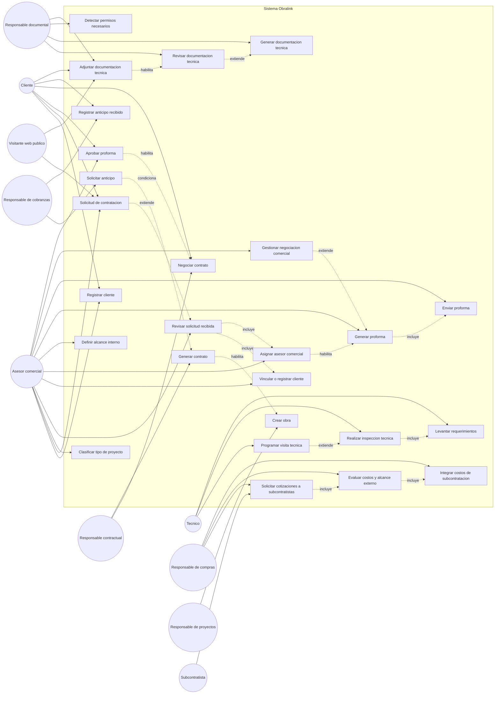

## Diagrama Del Flujo

```mermaid
flowchart TD

    A([Inicio]) --> B{Origen de solicitud}

    B -- Interna --> C[Captar cliente]
    C --> D[Registrar o vincular cliente]
    D --> E[Crear solicitud de contratacion]

    B -- Cliente autenticado --> F[Recibir solicitud desde portal de cliente]
    B -- Pagina publica --> G[Recibir solicitud desde formulario publico]
    G --> H[Validar captcha y verificacion de correo]

    F --> I[Revision interna de solicitud]
    H --> I

    I --> J{¿Solicitud aceptada para analisis?}
    J -- No --> K[Cerrar solicitud no concretada]
    J -- Sí --> L[Vincular o registrar cliente]
    L --> M[Asignar asesor comercial]
    M --> N[Crear proforma DRAFT]

    E --> N
    N --> O[Clasificar tipo de proyecto]

    O --> P{¿Requiere visita técnica?}

    P -- Sí --> Q[Programar visita técnica]
    Q --> R[Realizar inspección técnica]
    R --> S[Levantar requerimientos]

    P -- No --> S

    S --> T{¿Obra nueva o existente?}

    T --> U{¿El proyecto requiere documentación técnica?}

    U -- No --> AB[Detectar permisos necesarios]

    U -- Sí --> V{¿Existe documentación técnica?}

    V -- Sí --> W[Revisar documentación técnica existente]
    W --> AB

    V -- No --> X{¿Es necesario generar documentación técnica?}

    X -- Sí --> Y[Realizar levantamiento técnico]
    Y --> Z[Generar documentación técnica]
    Z --> AB

    X -- No --> AB

    AB --> AC{¿Requiere subcontratación?}

    AC -- Sí --> AD[Identificar especialidades externas]
    AD --> AE[Solicitar cotizaciones a subcontratistas]
    AE --> AF[Evaluar costos, tiempos y alcance externo]
    AF --> AG[Integrar costos de subcontratación]
    AG --> AH[Definir alcance interno del trabajo]

    AC -- No --> AH

    AH --> AI[Generar proforma]

    AI --> AJ{¿Proforma aprobada?}

    AJ -- No --> AK[Negociación comercial]
    AK --> AL{¿Nueva propuesta aceptada?}

    AL -- No --> K

    AL -- Sí --> AM[Actualizar proforma]
    AM --> AI

    AJ -- Sí --> AN[Negociación contractual]

    AN --> AO{¿Se requiere anticipo?}

    AO -- Sí --> AP[Solicitar anticipo]
    AP --> AQ{¿Anticipo recibido?}

    AQ -- No --> AR[Seguimiento de cobranza]
    AR --> AQ

    AQ -- Sí --> AS[Generar contrato]

    AO -- No --> AS

    AS --> AT[Crear obra]

    AT --> AU([Fin])
```



Nota: en este diagrama `Generar proforma` representa la generacion de una version formal presentable al cliente. La proforma `DRAFT` se crea al registrar una solicitud interna o cuando una solicitud recibida desde portal de cliente o pagina publica queda aceptada para analisis comercial.

## Diagrama De Casos De Uso



## Diagrama ER

```mermaid
erDiagram
    CLIENT {
        uuid id PK
        uuid company_id
        string client_type
        string display_name
        string legal_name
        string identification_type
        string identification_number
        string email
        string phone
        string address_line1
        string address_line2
        string city
        string state
        string county
        string postal_code
        string country
        string status
    }

    CLIENT_CONTACT {
        uuid id PK
        uuid client_id FK
        string name
        string role
        string email
        string phone
        boolean is_primary
    }

    CONTRACTING_REQUEST {
        uuid id PK
        uuid company_id
        uuid client_id FK
        uuid client_contact_id FK
        uuid created_by_user_id
        uuid assigned_advisor_id
        string origin_channel
        string status
        string source
        string requester_name
        string requester_email
        string requester_phone
        string requester_identification
        string site_address_line1
        string site_address_line2
        string site_city
        string site_state
        string site_county
        string site_postal_code
        string site_country
        string site_reference
        decimal site_latitude
        decimal site_longitude
        string public_tracking_code
        string email_verification_token
        boolean captcha_verified
        string source_ip
        string user_agent
        string description
        datetime created_at
    }

    PROJECT_CLASSIFICATION {
        uuid id PK
        uuid contracting_request_id FK
        string project_type
        string site_condition
        boolean requires_technical_visit
        boolean requires_technical_documentation
        boolean requires_subcontracting
    }

    CONTRACTING_REQUEST_REQUIREMENT_SUMMARY {
        uuid id PK
        uuid contracting_request_id FK
        string summary
        string constraints
        string scope_notes
    }

    PROFORMA {
        uuid id PK
        uuid company_id
        uuid contracting_request_id FK
        uuid current_version_id
        string status
        datetime created_at
        datetime updated_at
    }

    PROFORMA_VERSION {
        uuid id PK
        uuid proforma_id FK
        int version_number
        string status
        string scope_summary
        decimal internal_cost
        decimal external_cost
        decimal subtotal
        decimal taxes
        decimal total
        datetime sent_at
        datetime approved_at
        uuid approved_by_user_id
        string approval_source
        string approval_evidence
    }

    PROFORMA_LINE {
        uuid id PK
        uuid proforma_version_id FK
        string description
        decimal quantity
        decimal unit_price
        decimal total
    }

    COMMERCIAL_NEGOTIATION {
        uuid id PK
        uuid company_id
        uuid contracting_request_id FK
        uuid proforma_id FK
        uuid requested_by
        datetime requested_at
        string reason
        string client_comments
        string status
    }

    COMMERCIAL_NEGOTIATION_ITEM {
        uuid id PK
        uuid negotiation_id FK
        string change_type
        string description
        decimal impact_amount
        int impact_days
        boolean accepted
    }

    TECHNICAL_VISIT {
        uuid id PK
        uuid company_id
        uuid contracting_request_id FK
        datetime scheduled_at
        uuid assigned_user_id
        string status
    }

    TECHNICAL_INSPECTION {
        uuid id PK
        uuid technical_visit_id FK
        datetime inspected_at
        string observations
        string status
    }

    REQUIREMENT {
        uuid id PK
        uuid technical_inspection_id FK
        uuid contracting_request_id FK
        string description
        string priority
        boolean affects_proforma
    }

    TECHNICAL_SURVEY {
        uuid id PK
        uuid contracting_request_id FK
        uuid performed_by_user_id
        datetime performed_at
        string summary
        boolean affects_proforma
    }

    TECHNICAL_DOCUMENT {
        uuid id PK
        uuid contracting_request_id FK
        uuid client_id FK
        uuid project_id
        string document_type
        string status
    }

    DOCUMENT_REVIEW {
        uuid id PK
        uuid technical_document_id FK
        uuid reviewed_by_user_id
        datetime reviewed_at
        string result
        string observations
    }

    DOCUMENT_REQUIREMENT {
        uuid id PK
        uuid contracting_request_id FK
        string document_type
        boolean required
        string status
    }

    DOCUMENT_VERSION {
        uuid id PK
        uuid technical_document_id FK
        uuid attachment_id FK
        int version_number
        string status
        datetime created_at
    }

    ATTACHMENT {
        uuid id PK
        uuid company_id
        string owner_module
        string owner_type
        uuid owner_id
        string file_category
        string storage_provider
        string storage_region
        string bucket_name
        string container_name
        string object_key
        string object_version_id
        string original_filename
        string content_type
        int file_size_bytes
        string checksum_sha256
        string visibility
        string status
        string scan_status
        string encryption_method
        string kms_key_id
        datetime uploaded_at
        datetime available_at
        datetime expires_at
        uuid uploaded_by_user_id
        uuid uploaded_by_client_contact_id
        boolean uploaded_from_public_form
        string metadata_json
        datetime created_at
        datetime deleted_at
    }

    ATTACHMENT_ACCESS_LOG {
        uuid id PK
        uuid attachment_id FK
        uuid company_id
        uuid accessed_by_user_id
        uuid accessed_by_client_contact_id
        string action
        string source_ip
        string user_agent
        datetime accessed_at
    }

    PERMIT {
        uuid id PK
        uuid company_id
        string name
        string authority
        string description
    }

    PERMIT_REQUIREMENT {
        uuid id PK
        uuid contracting_request_id FK
        uuid permit_id FK
        string status
        datetime required_at
    }

    PERMIT_CHECKLIST {
        uuid id PK
        uuid permit_requirement_id FK
        string item
        boolean completed
    }

    PERMIT_STATUS_HISTORY {
        uuid id PK
        uuid permit_requirement_id FK
        string status
        uuid changed_by_user_id
        datetime changed_at
    }

    SUBCONTRACTOR {
        uuid id PK
        uuid company_id
        string display_name
        string identification_number
        string email
        string phone
        string status
    }

    SPECIALTY {
        uuid id PK
        uuid company_id
        string name
        string description
    }

    SUBCONTRACTOR_QUOTE_REQUEST {
        uuid id PK
        uuid contracting_request_id FK
        uuid specialty_id FK
        string scope_summary
        datetime requested_at
        string status
    }

    SUBCONTRACTOR_QUOTE {
        uuid id PK
        uuid quote_request_id FK
        uuid subcontractor_id FK
        decimal amount
        int estimated_days
        string scope
        string status
    }

    EXTERNAL_COST_EVALUATION {
        uuid id PK
        uuid contracting_request_id FK
        uuid quote_id FK
        uuid proforma_version_id FK
        decimal selected_amount
        int selected_days
        string evaluation_notes
    }

    CONTRACT {
        uuid id PK
        uuid company_id
        uuid client_id FK
        uuid contracting_request_id FK
        uuid proforma_version_id FK
        uuid current_version_id
        string status
        datetime generated_at
    }

    CONTRACT_VERSION {
        uuid id PK
        uuid contract_id FK
        uuid attachment_id FK
        int version_number
        string status
        datetime created_at
    }

    CONTRACT_NEGOTIATION {
        uuid id PK
        uuid contract_id FK
        string reason
        string status
        datetime started_at
    }

    CONTRACT_CLAUSE {
        uuid id PK
        uuid contract_version_id FK
        string clause_type
        string content
    }

    ADVANCE_PAYMENT {
        uuid id PK
        uuid contract_id FK
        decimal amount
        string status
        datetime requested_at
        datetime received_at
    }

    PAYMENT_REQUEST {
        uuid id PK
        uuid contract_id FK
        uuid advance_payment_id FK
        decimal amount
        datetime due_date
        string status
    }

    PAYMENT_RECORD {
        uuid id PK
        uuid payment_request_id FK
        decimal amount
        datetime paid_at
        string payment_method
        string reference
    }

    COLLECTION_FOLLOW_UP {
        uuid id PK
        uuid payment_request_id FK
        uuid responsible_user_id
        datetime follow_up_at
        string notes
        string status
    }

    PROJECT {
        uuid id PK
        uuid company_id
        uuid client_id FK
        uuid contracting_request_id FK
        uuid contract_id FK
        string name
        string status
        datetime created_at
    }

    WORK_SITE {
        uuid id PK
        uuid project_id FK
        string address_line1
        string address_line2
        string city
        string state
        string county
        string postal_code
        string country
        string reference
        decimal latitude
        decimal longitude
        string site_condition
    }

    PROJECT_SCOPE {
        uuid id PK
        uuid project_id FK
        uuid proforma_version_id FK
        string scope_summary
        string exclusions
    }

    PROJECT_MILESTONE {
        uuid id PK
        uuid project_id FK
        string name
        datetime planned_at
        datetime completed_at
        string status
    }

    CLIENT ||--o{ CLIENT_CONTACT : has
    CLIENT ||--o{ CONTRACTING_REQUEST : requests
    CLIENT_CONTACT ||--o{ CONTRACTING_REQUEST : submits
    CLIENT ||--o{ TECHNICAL_DOCUMENT : owns
    CLIENT ||--o{ CONTRACT : signs
    CLIENT ||--o{ PROJECT : owns

    CONTRACTING_REQUEST ||--o| PROJECT_CLASSIFICATION : classified_as
    CONTRACTING_REQUEST ||--o| CONTRACTING_REQUEST_REQUIREMENT_SUMMARY : summarizes
    CONTRACTING_REQUEST ||--o| PROFORMA : creates
    PROFORMA ||--o{ PROFORMA_VERSION : versions
    PROFORMA_VERSION ||--o{ PROFORMA_LINE : contains
    PROFORMA ||--o{ COMMERCIAL_NEGOTIATION : negotiated_by
    COMMERCIAL_NEGOTIATION ||--o{ COMMERCIAL_NEGOTIATION_ITEM : contains

    CONTRACTING_REQUEST ||--o{ TECHNICAL_VISIT : schedules
    TECHNICAL_VISIT ||--o| TECHNICAL_INSPECTION : produces
    TECHNICAL_INSPECTION ||--o{ REQUIREMENT : identifies
    CONTRACTING_REQUEST ||--o{ REQUIREMENT : groups
    CONTRACTING_REQUEST ||--o{ TECHNICAL_SURVEY : surveys

    CONTRACTING_REQUEST ||--o{ TECHNICAL_DOCUMENT : documents
    TECHNICAL_DOCUMENT ||--o{ DOCUMENT_REVIEW : reviewed_by
    TECHNICAL_DOCUMENT ||--o{ DOCUMENT_VERSION : versions
    ATTACHMENT ||--o{ DOCUMENT_VERSION : stores
    ATTACHMENT ||--o{ ATTACHMENT_ACCESS_LOG : audited_by
    CONTRACTING_REQUEST ||--o{ DOCUMENT_REQUIREMENT : requires

    CONTRACTING_REQUEST ||--o{ PERMIT_REQUIREMENT : needs
    PERMIT ||--o{ PERMIT_REQUIREMENT : required_as
    PERMIT_REQUIREMENT ||--o{ PERMIT_CHECKLIST : checklist
    PERMIT_REQUIREMENT ||--o{ PERMIT_STATUS_HISTORY : history

    CONTRACTING_REQUEST ||--o{ SUBCONTRACTOR_QUOTE_REQUEST : requests
    SPECIALTY ||--o{ SUBCONTRACTOR_QUOTE_REQUEST : categorizes
    SUBCONTRACTOR_QUOTE_REQUEST ||--o{ SUBCONTRACTOR_QUOTE : receives
    SUBCONTRACTOR ||--o{ SUBCONTRACTOR_QUOTE : sends
    SUBCONTRACTOR_QUOTE ||--o{ EXTERNAL_COST_EVALUATION : evaluated_as
    CONTRACTING_REQUEST ||--o{ EXTERNAL_COST_EVALUATION : evaluates
    PROFORMA_VERSION ||--o{ EXTERNAL_COST_EVALUATION : includes

    CONTRACTING_REQUEST ||--o| CONTRACT : becomes
    PROFORMA_VERSION ||--o| CONTRACT : approved_for
    CONTRACT ||--o{ CONTRACT_VERSION : versions
    ATTACHMENT ||--o{ CONTRACT_VERSION : stores
    CONTRACT_VERSION ||--o{ CONTRACT_CLAUSE : contains
    CONTRACT ||--o{ CONTRACT_NEGOTIATION : negotiated_by

    CONTRACT ||--o{ ADVANCE_PAYMENT : may_require
    CONTRACT ||--o{ PAYMENT_REQUEST : requests
    ADVANCE_PAYMENT ||--o{ PAYMENT_REQUEST : generates
    PAYMENT_REQUEST ||--o{ PAYMENT_RECORD : paid_by
    PAYMENT_REQUEST ||--o{ COLLECTION_FOLLOW_UP : followed_by

    CONTRACT ||--o| PROJECT : creates
    CONTRACTING_REQUEST ||--o| PROJECT : converted_to
    PROJECT ||--o| WORK_SITE : located_at
    PROJECT ||--o| PROJECT_SCOPE : defines
    PROJECT ||--o{ PROJECT_MILESTONE : tracks
    PROFORMA_VERSION ||--o| PROJECT_SCOPE : basis_for

    CONTRACTING_REQUEST ||--o{ ATTACHMENT : attaches
    TECHNICAL_VISIT ||--o{ ATTACHMENT : attaches
    TECHNICAL_INSPECTION ||--o{ ATTACHMENT : attaches
    PROFORMA ||--o{ ATTACHMENT : attaches
    CONTRACT ||--o{ ATTACHMENT : attaches
    PROJECT ||--o{ ATTACHMENT : attaches
    PAYMENT_RECORD ||--o{ ATTACHMENT : attaches
```



Nota: `company_id` y los campos terminados en `_user_id` son referencias externas al modulo `identity`. El ER mantiene esas referencias como IDs para conservar limites entre modulos.

## Plan De Implementacion

### Objetivo

Implementar el flujo comercial-tecnico-operativo como un monolito modular, manteniendo limites claros entre dominios para que en el futuro cada modulo pueda extraerse como microservicio sin reescribir la logica central.

`identity` no debe absorber esta logica. `identity` queda limitado a empresas, sucursales, usuarios, roles, permisos, modulos funcionales y menu.

### Modulos Funcionales

#### 1. commercial

Responsable del inicio y gestion comercial del flujo.

Procesos:

- Captar cliente.
- Registrar cliente.
- Crear solicitud de contratacion.
- Recibir solicitud de contratacion desde portal de cliente.
- Recibir solicitud de contratacion desde pagina web publica.
- Asignar asesor comercial responsable.
- Clasificar tipo de proyecto.
- Definir alcance interno del trabajo.
- Generar proforma.
- Actualizar proforma.
- Aprobar proforma.
- Gestionar negociacion comercial.
- Cerrar solicitud no concretada.

Entidades sugeridas:

- `Client`
- `ClientContact`
- `ContractingRequest`
- `ProjectClassification`
- `ContractingRequestRequirementSummary`
- `Proforma`
- `ProformaVersion`
- `ProformaLine`
- `CommercialNegotiation`
- `CommercialNegotiationItem`

Eventos sugeridos:

- `ClientRegistered`
- `ContractingRequestCreated`
- `ContractingRequestSubmitted`
- `ContractingRequestAssigned`
- `ContractingRequestClassified`
- `ProformaDraftCreated`
- `ProformaGenerated`
- `ProformaSent`
- `ProformaRejected`
- `CommercialNegotiationStarted`
- `CommercialNegotiationAccepted`
- `ProformaVersionCreated`
- `ProformaApproved`
- `ContractingRequestLost`

Origen de solicitudes de contratacion:

Una solicitud de contratacion puede ser creada desde tres canales:

```text
INTERNAL      -> creada por un asesor comercial desde el sistema interno
CLIENT_AUTH   -> creada por un cliente autenticado desde su portal
PUBLIC_WEB    -> creada por una persona desde una pagina web publica sin usuario
```

Campos sugeridos para `contracting_requests`:

```text
id
company_id
client_id nullable
client_contact_id nullable
created_by_user_id nullable
assigned_advisor_id nullable
origin_channel          INTERNAL | CLIENT_AUTH | PUBLIC_WEB
status
source
requester_name
requester_email
requester_phone
requester_identification
site_address_line1
site_address_line2
site_city
site_state
site_county
site_postal_code
site_country
site_reference
site_latitude nullable
site_longitude nullable
public_tracking_code
email_verification_token
captcha_verified
source_ip
user_agent
description
created_at
updated_at
deleted_at
```

Reglas:

- Si `origin_channel = INTERNAL`, la solicitud es creada por un asesor comercial y debe registrar `created_by_user_id`.
- Si `origin_channel = CLIENT_AUTH`, la solicitud es creada por un cliente autenticado y debe registrar el usuario o contacto que la creo.
- Si `origin_channel = PUBLIC_WEB`, la solicitud puede crearse sin `client_id`, sin `client_contact_id` y sin `created_by_user_id`.
- Una solicitud `PUBLIC_WEB` debe guardar los datos capturados del solicitante, `public_tracking_code`, verificacion de correo cuando aplique, `captcha_verified`, `source_ip` y `user_agent`.
- Si el solicitante ya existe como cliente, el sistema puede vincular la solicitud a `client_id`.
- Si el solicitante no existe como cliente, la solicitud queda pendiente de revision para que un asesor comercial cree o vincule el cliente.
- La solicitud debe poder registrar la ubicacion inicial del sitio de trabajo mediante direccion, ciudad, estado, condado, ZIP code, pais y referencia.
- `site_latitude` y `site_longitude` son opcionales; pueden venir del formulario publico, del portal del cliente o de una geocodificacion posterior.
- La ubicacion pertenece a la solicitud, no al cliente, porque un mismo cliente puede tener trabajos en diferentes sitios.
- Al crear la obra, la ubicacion de la solicitud debe copiarse o consolidarse en `projects.work_sites`.
- Las solicitudes creadas por cliente autenticado o por pagina publica deben iniciar en `SUBMITTED` o `PENDING_REVIEW`, no deben pasar directamente a una proforma formal sin revision interna.
- `assigned_advisor_id` identifica al asesor responsable de revisar, clasificar y continuar el flujo comercial.
- La auditoria de una solicitud sin usuario autenticado debe basarse en canal de origen, datos capturados, IP, user agent, codigo publico de seguimiento y evidencia de verificacion.

Gestion de proformas:

La proforma tiene dos momentos distintos:

- Creacion de proforma borrador.
- Generacion de proforma presentable al cliente.

Al crear o aceptar internamente una solicitud de contratacion, el sistema debe crear una proforma inicial en estado `DRAFT`. Esta proforma funciona como contenedor de alcance, cantidades, costos, impuestos, notas comerciales y condiciones que se van completando durante el proceso.

Reglas segun origen:

- Si la solicitud fue creada por un asesor comercial (`INTERNAL`), la proforma `DRAFT` puede crearse automaticamente al registrar la solicitud.
- Si la solicitud fue creada por un cliente autenticado (`CLIENT_AUTH`) o desde pagina publica (`PUBLIC_WEB`), primero debe pasar por revision interna, vinculacion de cliente y asignacion de asesor.
- La proforma `DRAFT` se crea cuando la solicitud queda aceptada para analisis comercial, no simplemente por recibir un formulario publico.

En el diagrama, el paso `Generar proforma` no significa crear el registro inicial, sino convertir la proforma trabajada en una version formal y presentable al cliente.

En el flujo:

```text
Crear o aceptar solicitud de contratacion
  -> Crear proforma DRAFT
  -> Completar analisis tecnico, documental, permisos, subcontratacion y alcance
  -> Definir alcance interno del trabajo
  -> Generar version formal de proforma
  -> Enviar al cliente
```

Antes de generar una proforma presentable al cliente deben existir, como minimo:

- Cliente registrado.
- Solicitud de contratacion creada.
- Tipo de proyecto clasificado.
- Requerimientos base levantados.
- Condicion de obra nueva o existente identificada.
- Documentacion tecnica revisada o generada cuando aplique.
- Permisos necesarios detectados.
- Costos de subcontratacion integrados cuando aplique.
- Alcance interno del trabajo definido.

Estados sugeridos para `proformas`:

```text
DRAFT
IN_REVIEW
NEEDS_REVISION
GENERATED
SENT
UNDER_NEGOTIATION
APPROVED
REJECTED
CANCELLED
```

Reglas:

- `DRAFT`: se crea automaticamente al crear una solicitud interna o al aceptar una solicitud recibida desde cliente autenticado o pagina publica.
- `IN_REVIEW`: se esta alimentando con visitas, requerimientos, documentos, permisos, costos externos y alcance.
- `NEEDS_REVISION`: algun cambio tecnico, documental, de permisos, subcontratacion o alcance obliga a revisar.
- `GENERATED`: el alcance interno esta definido y existe una version formal lista para enviar.
- `SENT`: la version formal fue enviada al cliente.
- `UNDER_NEGOTIATION`: el cliente no aprobo y solicito modificaciones.
- `APPROVED`: la version vigente fue aprobada por el cliente o registrada como aprobada por un asesor comercial autorizado.
- Antes de `SENT`, se puede editar la version activa.
- Despues de `SENT`, cualquier cambio debe crear una nueva version.
- Despues de `APPROVED`, la proforma no se modifica directamente; cualquier cambio debe generar una nueva version o una solicitud formal de cambio.
- Para aprobar una proforma desde el sistema, el asesor comercial debe tener el permiso `commercial.proformas.approve`.
- Cuando el asesor comercial registra la aprobacion, debe guardar la evidencia de aceptacion del cliente cuando aplique: comentario, correo, documento, fecha, adjunto o referencia externa.

Versionado sugerido:

```text
proformas
  id
  company_id
  contracting_request_id
  current_version_id
  status
  created_at
  updated_at
  deleted_at

proforma_versions
  id
  proforma_id
  version_number
  status
  scope_summary
  internal_cost
  external_cost
  subtotal
  taxes
  total
  sent_at
  approved_at
  approved_by_user_id
  approval_source          CLIENT | COMMERCIAL_ADVISOR
  approval_evidence
  rejected_at
  created_at
  updated_at
```

Datos minimos del evento `ProformaApproved`:

```text
proforma_id
proforma_version_id
approved_at
approved_by_user_id
approval_source          CLIENT | COMMERCIAL_ADVISOR
approval_evidence
```

Negociacion comercial cuando el cliente no aprueba:

Si el cliente no aprueba la proforma final y solicita modificaciones, el proceso sigue en `commercial`; no pasa a `contracts`.

Secuencia:

```text
Proforma SENT
  -> Cliente no aprueba
  -> Proforma UNDER_NEGOTIATION
  -> Crear commercial_negotiation
  -> Registrar cambios solicitados
  -> Evaluar impacto en alcance, costos y tiempos
  -> Crear nueva version de proforma
  -> Enviar nueva version al cliente
  -> Proforma aprobada o rechazada
```

Tablas sugeridas:

```text
commercial_negotiations
  id
  company_id
  contracting_request_id
  proforma_id
  requested_by
  requested_at
  reason
  client_comments
  status              OPEN | ACCEPTED | REJECTED | CLOSED_LOST
  created_at
  updated_at
  deleted_at

commercial_negotiation_items
  id
  negotiation_id
  change_type         SCOPE | PRICE | TIME | PAYMENT_TERMS | MATERIALS | OTHER
  description
  impact_amount
  impact_days
  accepted
  created_at
  updated_at
```

Reglas de negociacion:

- Una proforma enviada no se modifica directamente.
- Si el cliente pide cambios, se registra una negociacion comercial.
- Si la nueva propuesta es aceptada, se crea una nueva version de proforma y se envia al cliente.
- Si la nueva propuesta no es aceptada, la solicitud de contratacion se cierra como no concretada.
- `contracts` solo inicia cuando una version de proforma esta `APPROVED`.
- La aprobacion puede provenir del cliente o ser registrada por un asesor comercial autorizado con evidencia de aceptacion.

Especificacion de clientes:

El cliente comercial puede ser una persona natural o una empresa. No debe reutilizarse la tabla `companies` para representar clientes comerciales, porque `companies` representa empresas tenant que usan el sistema. Los clientes comerciales deben vivir en `commercial.clients`.

```text
companies = empresas usuarias del sistema
clients   = clientes atendidos por una empresa usuaria
```

Campos sugeridos para `clients`:

```text
id
company_id
client_type              PERSON | COMPANY
display_name
legal_name
identification_type      EIN | ITIN | PASSPORT | DRIVER_LICENSE | STATE_ID | TAX_ID | OTHER
identification_number
email
phone
address_line1
address_line2
city
state
county
postal_code
country
status
created_at
updated_at
deleted_at
```

Reglas:

- Si `client_type = PERSON`, `display_name` representa el nombre de la persona.
- Si `client_type = COMPANY`, `display_name` representa el nombre comercial y `legal_name` la razon social.
- `identification_number` debe ser unico por `company_id` cuando exista y el registro no este eliminado.
- Toda solicitud de contratacion aceptada para analisis comercial debe apuntar a `client_id`, sin importar si el cliente es persona o empresa.
- Una solicitud `PUBLIC_WEB` puede existir temporalmente sin `client_id` mientras esta en revision.
- Para clientes de Estados Unidos, `state` debe almacenar el codigo postal del estado en formato ISO/USPS de dos letras, por ejemplo `FL`, `TX` o `NY`.
- `postal_code` debe soportar ZIP de 5 digitos y ZIP+4.
- `country` debe existir aunque el valor por defecto operativo sea `US`.
- No se debe almacenar SSN completo salvo que exista una necesidad legal explicita; si se requiere trazabilidad, preferir tokenizacion, ultimos 4 digitos o referencia externa segura.

Campos sugeridos para `client_contacts`:

```text
id
client_id
name
role
email
phone
is_primary
created_at
updated_at
deleted_at
```

Reglas de contactos:

- Un cliente tipo `COMPANY` puede tener varios contactos.
- Un cliente tipo `PERSON` puede tener contactos adicionales, pero no es obligatorio.
- Solo debe existir un contacto principal por cliente.

#### 2. technical

Responsable de visitas, inspecciones y levantamientos tecnicos.

Procesos:

- Programar visita tecnica.
- Realizar inspeccion tecnica.
- Levantar requerimientos.
- Identificar si la obra es nueva o existente.
- Realizar levantamiento tecnico.

Entidades sugeridas:

- `TechnicalVisit`
- `TechnicalInspection`
- `Requirement`
- `TechnicalSurvey`
- `ProjectSiteCondition`

Eventos sugeridos:

- `TechnicalVisitScheduled`
- `TechnicalInspectionCompleted`
- `RequirementsCollected`
- `RequirementsChanged`
- `TechnicalSurveyCompleted`
- `TechnicalSurveyChanged`

Impacto sobre proformas:

La visita tecnica y el levantamiento tecnico pueden modificar la proforma, pero el modulo `technical` no debe actualizar directamente tablas de `commercial`.

Regla:

- Si una visita tecnica, inspeccion, requerimiento o levantamiento tecnico modifica alcance, cantidades, tiempos, restricciones, costos estimados o condiciones del sitio, `technical` debe emitir un evento.
- `commercial` debe consumir ese evento y decidir si la solicitud de contratacion vuelve a revision de alcance o costeo.
- Si ya existe una proforma vigente, debe marcarse como `NEEDS_REVISION` o crearse una nueva version.
- La version anterior de la proforma debe mantenerse como historial.
- Una proforma `APPROVED` no debe modificarse directamente; cualquier cambio posterior debe generar una nueva version o una solicitud formal de cambio.

Eventos de integracion sugeridos:

- `RequirementsChanged`
- `TechnicalSurveyChanged`
- `ProformaRevisionRequired`
- `ProformaVersionCreated`

Permisos sugeridos:

```text
technical.requirements.affect_proforma
technical.surveys.affect_proforma
commercial.proformas.mark_needs_revision
commercial.proformas.version
```

#### 3. attachments

Responsable de almacenar metadatos y referencias de archivos adjuntos guardados en proveedores externos como AWS S3 o Azure Blob Storage.

Este modulo no debe guardar archivos binarios en la base de datos. Solo guarda metadatos, ownership logico, proveedor de almacenamiento y `object_key`.

Procesos:

- Registrar adjuntos de solicitudes de contratacion, clientes, visitas tecnicas, inspecciones, proformas, contratos, pagos y obras.
- Generar URLs firmadas temporales para carga, descarga o visualizacion.
- Validar tipo de archivo, tamano maximo, checksum y visibilidad.
- Registrar adjuntos enviados desde formularios publicos.
- Asociar fotos, videos, audios, PDFs, contratos, facturas, recibos y documentos tecnicos a entidades del sistema.
- Procesar archivos cargados mediante cola/eventos para antivirus, metadata, thumbnails o transcodificacion.
- Auditar accesos, descargas, eliminaciones y confirmaciones de upload.

Entidades sugeridas:

- `Attachment`
- `AttachmentAccessLog`

Campos sugeridos para `attachments`:

```text
id
company_id
owner_module              commercial | technical | documents | contracts | billing | projects
owner_type                CONTRACTING_REQUEST | CLIENT | PROFORMA | CONTRACT | TECHNICAL_VISIT | TECHNICAL_INSPECTION | PROJECT | PAYMENT_RECORD | TECHNICAL_DOCUMENT
owner_id
file_category             PHOTO | VIDEO | AUDIO | PDF | CONTRACT | INVOICE | RECEIPT | TECHNICAL_DOCUMENT | OTHER
storage_provider          AWS_S3 | AZURE_BLOB
storage_region
bucket_name
container_name
object_key
object_version_id
original_filename
content_type
file_size_bytes
checksum_sha256
visibility                PRIVATE | PUBLIC_READ | SIGNED_URL
status                    UPLOAD_REQUESTED | UPLOADED | SCANNING | AVAILABLE | REJECTED | DELETED
scan_status               PENDING | CLEAN | INFECTED | FAILED | SKIPPED
encryption_method         SSE_S3 | SSE_KMS | AZURE_MANAGED | AZURE_CMK
kms_key_id nullable
uploaded_at
available_at
expires_at nullable
uploaded_by_user_id nullable
uploaded_by_client_contact_id nullable
uploaded_from_public_form
metadata_json
created_at
deleted_at
```

Campos sugeridos para `attachment_access_logs`:

```text
id
attachment_id
company_id
accessed_by_user_id nullable
accessed_by_client_contact_id nullable
action                    VIEW | DOWNLOAD | DELETE | UPLOAD_CONFIRM | PRESIGNED_UPLOAD_REQUEST | PRESIGNED_DOWNLOAD_REQUEST
source_ip
user_agent
accessed_at
```

Reglas:

- Guardar `object_key`, no una URL publica permanente.
- Para acceso a archivos privados, generar URLs firmadas temporales.
- Los clientes, visitantes publicos y frontends no deben subir archivos pasando por el backend; deben usar pre-signed POST/PUT en S3 o SAS/presigned URL en Azure Blob.
- Para AWS S3, `bucket_name` identifica el bucket y `object_key` la ruta del objeto.
- Para Azure Blob Storage, `container_name` identifica el contenedor y `object_key` el blob.
- Guardar `storage_region`, `bucket_name` o `container_name`, `object_key` y `object_version_id` cuando el proveedor lo soporte.
- Separar objetos por tenant, ambiente y modulo con una ruta estable:

```text
company/{company_id}/env/{environment}/module/{owner_module}/owner/{owner_type}/{owner_id}/attachment/{attachment_id}/{original_filename}
```

- Usar buckets o contenedores separados por ambiente, por ejemplo `obralink-dev-attachments`, `obralink-staging-attachments` y `obralink-prod-attachments`.
- Activar versionado del bucket o contenedor cuando aplique a contratos o documentos legales.
- Configurar lifecycle rules para mover archivos antiguos a AWS Glacier, S3 Infrequent Access, Azure Cool o Azure Archive.
- Los adjuntos temporales de formularios publicos deben expirar o eliminarse si la solicitud no se confirma.
- Validar extensiones, `content_type`, tamano maximo y `checksum_sha256` antes de confirmar el adjunto.
- Validar tamano y tipo segun categoria, por ejemplo fotos hasta 15MB, PDFs hasta 50MB, videos hasta 500MB y audios hasta 100MB, ajustable por configuracion.
- Todo upload publico debe pasar por estado `SCANNING` antes de quedar `AVAILABLE`.
- El flujo recomendado es `UPLOAD_REQUESTED -> UPLOADED -> SCANNING -> AVAILABLE` o `REJECTED`.
- Para AWS, preferir SSE-KMS en documentos legales o sensibles y guardar `kms_key_id`.
- Para Azure, usar claves administradas o customer-managed keys cuando aplique y registrar `encryption_method`.
- No exponer buckets publicamente. Para visualizacion de fotos, videos o PDFs, usar URL firmada de S3/Azure o CloudFront privado con signed URLs/signed cookies.
- Para procesamiento asincrono en AWS, usar eventos de S3 hacia SQS y workers que calculen metadata, thumbnails, duracion, checksum y resultado de antivirus.
- Para procesamiento asincrono en Azure, usar Event Grid o Queue Storage con workers equivalentes.
- Procesar videos y audios de forma asincrona si requieren transcodificacion, extraccion de metadata o analisis posterior.
- Los uploads publicos deben usar URLs prefirmadas con expiracion corta, limites de tamano y restricciones de tipo.
- Registrar en `attachment_access_logs` cada solicitud de URL firmada, visualizacion, descarga, confirmacion de upload y eliminacion.
- Aplicar validacion multi-tenant en backend: un usuario de una empresa no debe poder generar URL firmada para objetos de otra empresa aunque conozca el `object_key`.

#### 4. documents

Responsable de documentacion tecnica.

Procesos:

- Determinar si se requiere documentacion tecnica.
- Recibir documentacion tecnica existente enviada por el cliente.
- Permitir que el responsable documental adjunte documentacion tecnica del proyecto.
- Revisar documentacion tecnica existente.
- Generar documentacion tecnica.
- Asociar documentos a solicitud de contratacion, cliente u obra.

Entidades sugeridas:

- `TechnicalDocument`
- `DocumentReview`
- `DocumentRequirement`
- `DocumentVersion`

Reglas:

- `DocumentVersion` debe apuntar a `attachment_id` para ubicar el archivo fisico.
- `documents` define el significado tecnico del documento; `attachments` define donde esta almacenado y como accederlo.
- No guardar `file_url` permanente en `DocumentVersion`; solicitar al modulo `attachments` una URL firmada temporal cuando se necesite consultar o descargar el archivo.
- El cliente autenticado puede adjuntar documentacion tecnica existente desde su portal.
- Un visitante desde pagina publica puede adjuntar documentacion tecnica inicial al crear la solicitud, siempre usando restricciones de tipo, tamano y expiracion.
- El responsable documental puede adjuntar, clasificar, reemplazar o versionar documentacion tecnica del proyecto.
- Los archivos enviados por cliente o visitante deben registrarse primero como `Attachment` y luego vincularse a `TechnicalDocument` o `DocumentVersion` cuando sean aceptados en revision documental.
- Las categorias permitidas para documentacion tecnica incluyen `PDF`, `PHOTO`, `TECHNICAL_DOCUMENT` y `OTHER`; videos y audios deben tratarse como evidencia o soporte, no como documento tecnico principal salvo regla explicita.

Eventos sugeridos:

- `TechnicalDocumentationRequired`
- `TechnicalDocumentationSubmitted`
- `TechnicalDocumentationReviewed`
- `TechnicalDocumentationGenerated`

#### 5. permits

Responsable de permisos requeridos por el proyecto.

Procesos:

- Detectar permisos necesarios.
- Registrar permisos requeridos.
- Controlar estado de permisos.

Entidades sugeridas:

- `Permit`
- `PermitRequirement`
- `PermitChecklist`
- `PermitStatusHistory`

Eventos sugeridos:

- `PermitRequirementsDetected`
- `PermitRequirementUpdated`

#### 6. procurement

Responsable de subcontratacion y costos externos.

Procesos:

- Identificar especialidades externas.
- Solicitar cotizaciones a subcontratistas.
- Evaluar costos, tiempos y alcance externo.
- Integrar costos de subcontratacion.

Entidades sugeridas:

- `Subcontractor`
- `Specialty`
- `SubcontractorQuoteRequest`
- `SubcontractorQuote`
- `ExternalCostEvaluation`

Eventos sugeridos:

- `ExternalSpecialtiesIdentified`
- `SubcontractorQuotesRequested`
- `SubcontractorCostsEvaluated`
- `SubcontractorCostsIntegrated`

#### 7. contracts

Responsable de la negociacion y generacion contractual.

Procesos:

- Negociacion contractual.
- Generar contrato.
- Versionar contrato.

Entidades sugeridas:

- `Contract`
- `ContractVersion`
- `ContractNegotiation`
- `ContractClause`

Reglas:

- `ContractVersion` debe apuntar a `attachment_id` para conservar cada version legal del contrato.
- Los contratos firmados o aceptados deben almacenarse como adjuntos privados con acceso mediante URL firmada temporal.
- Si se requiere historial legal fuerte, activar versionado del bucket/contenedor y conservar `checksum_sha256` del archivo.

Eventos sugeridos:

- `ContractNegotiationStarted`
- `ContractGenerated`
- `ContractSigned`

#### 8. billing

Responsable de anticipos, pagos y seguimiento de cobranza.

Procesos:

- Determinar si se requiere anticipo.
- Solicitar anticipo.
- Registrar anticipo recibido.
- Seguimiento de cobranza.

Entidades sugeridas:

- `AdvancePayment`
- `PaymentRequest`
- `PaymentRecord`
- `CollectionFollowUp`

Eventos sugeridos:

- `AdvancePaymentRequired`
- `AdvancePaymentRequested`
- `AdvancePaymentReceived`
- `CollectionFollowUpCreated`

#### 9. projects

Responsable de la obra despues de la aprobacion comercial y contractual.

Procesos:

- Crear obra.
- Vincular obra con cliente, solicitud de contratacion, contrato y alcance aprobado.
- Crear o consolidar ubicacion de obra desde la ubicacion registrada en la solicitud de contratacion.

Entidades sugeridas:

- `Project`
- `WorkSite`
- `ProjectScope`
- `ProjectMilestone`

Eventos sugeridos:

- `ProjectCreated`

### Estructura De Carpetas Por Modulo

Cada modulo nuevo debe seguir la misma organizacion base:

```text
src/modules/<module-name>
  application
    commands
    command-handlers
    queries
    query-handlers
    dto
    services
  domain
    constants
    entities
    enums
    events
    repositories
    services
  infrastructure
    persistence
      typeorm
        entities
        repositories
  presentation
    controllers
    presenters
  <module-name>.module.ts
```

### Reglas De Diseno Para Escalar A Microservicios

- Cada modulo debe ser dueno de sus propias tablas.
- Un modulo no debe leer repositorios internos de otro modulo.
- La comunicacion entre modulos debe hacerse mediante servicios de aplicacion o eventos de dominio/aplicacion.
- Las relaciones entre modulos deben guardar IDs externos, no depender de entidades ORM de otro modulo.
- Los contratos entre modulos deben expresarse con DTOs/eventos estables.
- Los permisos y menu de cada modulo deben registrarse en `identity` mediante seeds y constantes, no con strings sueltos.

### Flujo Entre Modulos

```text
commercial
  ClientRegistered
  ContractingRequestCreated
  ContractingRequestSubmitted
  ContractingRequestAssigned
  ProformaDraftCreated
  ContractingRequestClassified
        |
        v
technical
  TechnicalVisitScheduled
  TechnicalInspectionCompleted
  RequirementsCollected
        |
        v
attachments
  AttachmentUploaded
  AttachmentLinked
        |
        v
documents
  TechnicalDocumentationRequired
  TechnicalDocumentationReviewed
  TechnicalDocumentationGenerated
        |
        v
permits
  PermitRequirementsDetected
        |
        v
procurement
  SubcontractorQuotesRequested
  SubcontractorCostsIntegrated
        |
        v
commercial
  ProformaGenerated
  ProformaSent
  CommercialNegotiationStarted
  ProformaVersionCreated
  ProformaApproved
        |
        v
contracts
  ContractNegotiationStarted
        |
        v
billing
  AdvancePaymentRequested
  AdvancePaymentReceived
        |
        v
contracts
  ContractGenerated
  ContractSigned
        |
        v
projects
  ProjectCreated
```

### Orden De Implementacion

#### Fase 1: Base Comercial

- Crear modulo `commercial`.
- Crear entidades `Client`, `ClientContact`, `ContractingRequest`, `ProjectClassification`, `Proforma`, `ProformaVersion`, `ProformaLine`, `CommercialNegotiation` y `CommercialNegotiationItem`.
- Crear CRUD inicial de clientes.
- Crear CRUD inicial de solicitudes de contratacion.
- Crear endpoint interno para solicitudes creadas por asesor comercial.
- Crear endpoint autenticado para solicitudes creadas desde portal de cliente.
- Crear endpoint publico para solicitudes creadas desde pagina web publica.
- Crear endpoints para revisar, vincular cliente y asignar asesor comercial a solicitudes `PUBLIC_WEB`.
- Crear proforma `DRAFT` automaticamente al crear una solicitud interna o al aceptar una solicitud recibida desde cliente autenticado o pagina publica.
- Crear endpoints para clasificar solicitud de contratacion.
- Crear endpoints para versionar, generar, enviar y aprobar proforma.
- Crear endpoints para registrar negociacion comercial y generar nueva version cuando el cliente solicita cambios.
- Crear permisos y menu para clientes, solicitudes de contratacion y proformas, incluyendo `commercial.proformas.approve`.

#### Fase 2: Visitas Y Requerimientos Tecnicos

- Crear modulo `technical`.
- Crear entidades `TechnicalVisit`, `TechnicalInspection` y `Requirement`.
- Crear endpoints para programar visita tecnica.
- Crear endpoints para completar inspeccion y levantar requerimientos.
- Conectar solicitud de contratacion con visita tecnica mediante `contractingRequestId`.

#### Fase 3: Adjuntos Y Almacenamiento Externo

- Crear modulo `attachments`.
- Crear entidades `Attachment` y `AttachmentAccessLog`.
- Crear abstraccion de almacenamiento para AWS S3 y Azure Blob Storage.
- Crear endpoints para solicitar URLs prefirmadas de carga y descarga.
- Crear endpoints para confirmar adjuntos cargados y asociarlos a `owner_module`, `owner_type` y `owner_id`.
- Crear endpoints seguros para adjuntos enviados desde portal de cliente y pagina publica.
- Validar `content_type`, tamano maximo, checksum y categoria de archivo.
- Definir estructura de `object_key` por empresa, modulo, entidad y adjunto.
- Crear reglas de lifecycle para archivos temporales, adjuntos publicos no confirmados y documentos historicos.
- Implementar estados `UPLOAD_REQUESTED`, `UPLOADED`, `SCANNING`, `AVAILABLE`, `REJECTED` y `DELETED`.
- Implementar escaneo antivirus/malware para uploads publicos antes de marcar adjuntos como `AVAILABLE`.
- Implementar workers asincronos con S3 Event + SQS o Azure Event Grid/Queue Storage.
- Registrar `storage_region`, `object_version_id`, `encryption_method` y `kms_key_id` cuando aplique.
- Configurar buckets o contenedores separados por ambiente y bloqueo de acceso publico.
- Crear auditoria de acceso para solicitudes de URL firmada, visualizaciones, descargas, confirmaciones y eliminaciones.

#### Fase 4: Documentacion Tecnica

- Crear modulo `documents`.
- Crear entidades `TechnicalDocument`, `DocumentReview`, `DocumentRequirement` y `DocumentVersion`.
- Crear endpoints para registrar documentacion existente.
- Crear endpoints para que cliente autenticado o visitante publico adjunte documentacion tecnica existente.
- Crear endpoints para revisar o generar documentacion tecnica.
- Crear endpoints para que el responsable documental clasifique, acepte, rechace o versione documentos adjuntos.
- Conectar `DocumentVersion` con `Attachment` mediante `attachmentId`.

#### Fase 5: Permisos

- Crear modulo `permits`.
- Crear entidades `Permit`, `PermitRequirement` y `PermitChecklist`.
- Crear endpoints para detectar y administrar permisos requeridos.

#### Fase 6: Subcontratacion

- Crear modulo `procurement`.
- Crear entidades `Subcontractor`, `Specialty`, `SubcontractorQuoteRequest`, `SubcontractorQuote` y `ExternalCostEvaluation`.
- Crear endpoints para solicitar y evaluar cotizaciones.
- Integrar costos externos en la proforma.

#### Fase 7: Contratos

- Crear modulo `contracts`.
- Crear entidades `Contract`, `ContractVersion` y `ContractNegotiation`.
- Crear endpoints para iniciar negociacion contractual despues de proforma aprobada.
- Conectar `ContractVersion` con `Attachment` mediante `attachmentId`.
- Definir si se requiere anticipo antes de generar contrato.

#### Fase 8: Anticipos Y Cobranza

- Crear modulo `billing`.
- Crear entidades `AdvancePayment`, `PaymentRequest`, `PaymentRecord` y `CollectionFollowUp`.
- Crear endpoints para solicitar anticipo y registrar pagos.
- Notificar a `contracts` cuando el anticipo requerido fue recibido.

#### Fase 9: Generacion Contractual

- Completar endpoints de `contracts` para generar contrato despues de anticipo recibido o cuando no se requiere anticipo.
- Registrar firma o aceptacion del contrato cuando aplique.

#### Fase 10: Creacion De Obra

- Crear modulo `projects`.
- Crear entidades `Project`, `WorkSite` y `ProjectScope`.
- Crear endpoint para crear obra desde contrato generado y aceptado o firmado, segun la regla contractual configurada.
- Copiar o consolidar direccion, ciudad, estado, condado, ZIP code, pais, referencia y coordenadas desde la solicitud de contratacion hacia `WorkSite`.
- Mantener referencias a `clientId`, `contractingRequestId`, `contractId` y `companyId`.

### Primer Corte Recomendado

El primer incremento funcional debe cubrir:

- Registro de cliente.
- Creacion de solicitud de contratacion.
- Clasificacion de solicitud de contratacion.
- Decision de visita tecnica.
- Creacion automatica de proforma `DRAFT` para solicitudes internas o aceptadas despues de revision.
- Generacion basica de una version formal de proforma.

Este corte crea la columna vertebral del flujo sin bloquearse por documentos, permisos, subcontratistas, contratos o pagos.
