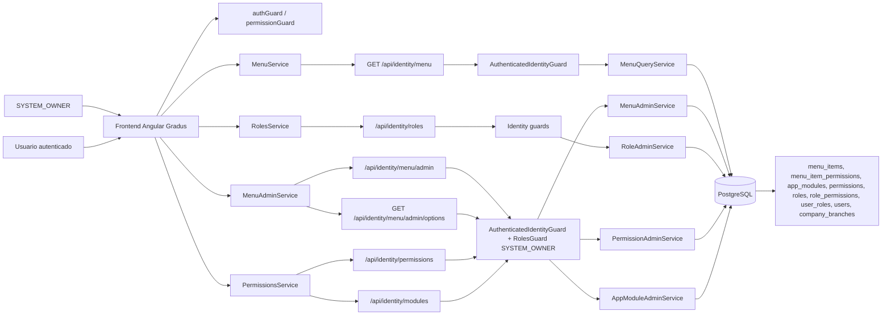
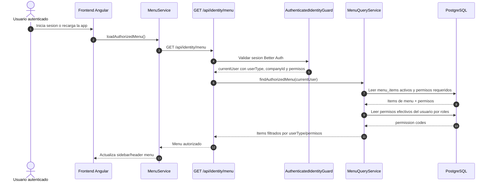
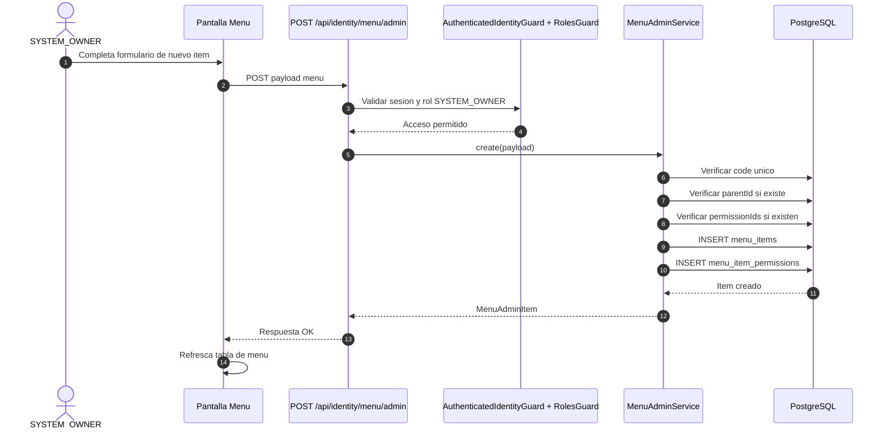
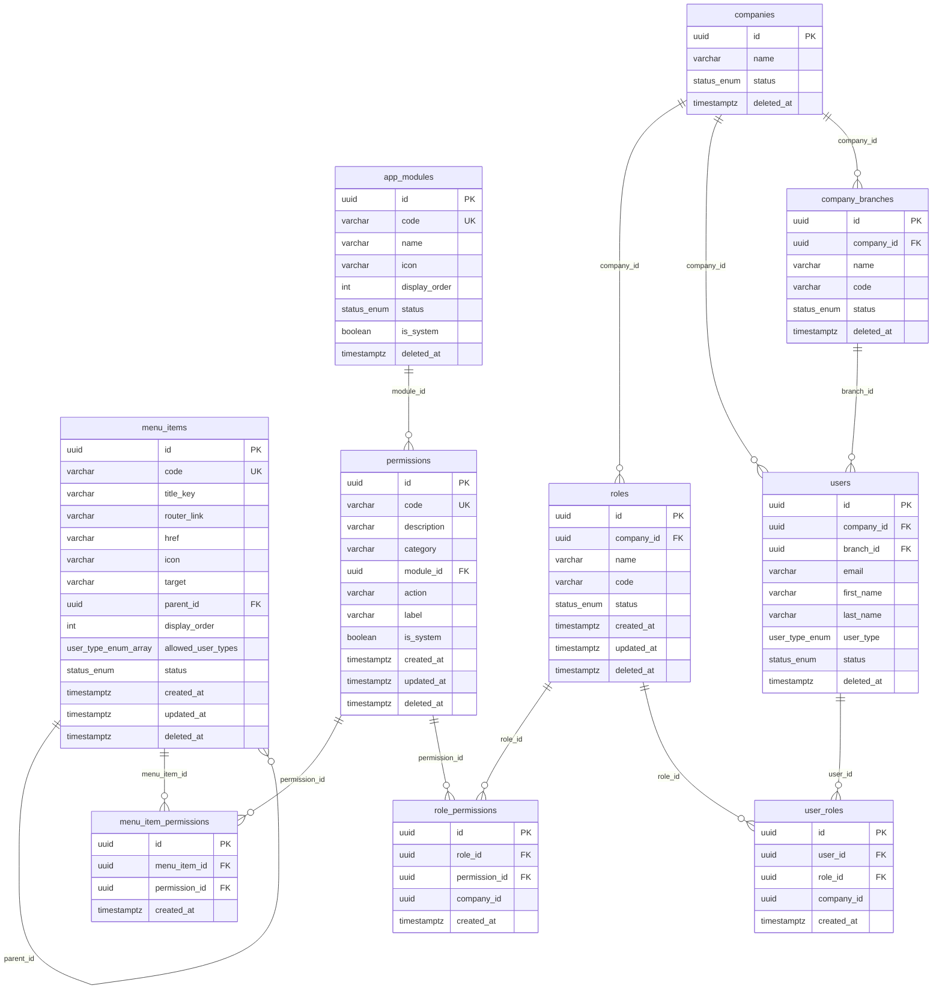

# Parametrizacion de opciones de menu en Obralink

Esta guia explica como crear una nueva opcion de menu para el sistema Obralink usando la gestion implementada para el usuario `SYSTEM_OWNER`.

## Conceptos

El menu se guarda en la tabla `menu_items` y se entrega al frontend desde:

```text
GET /api/identity/menu
```

Ese endpoint devuelve solo las opciones visibles para el usuario autenticado. La visibilidad depende de:

- `status`: solo se muestran items `ACTIVE`.
- `allowedUserTypes`: si tiene valores, el usuario debe tener uno de esos tipos.
- `permissions`: si el item tiene permisos asociados, el usuario debe tenerlos. `SYSTEM_OWNER` puede verlos por defecto.
- Jerarquia: si un submenu es visible, su padre tambien se muestra.

La administracion completa del menu se hace desde:

```text
GET    /api/identity/menu/admin
GET    /api/identity/menu/admin/tree
GET    /api/identity/menu/admin/options
POST   /api/identity/menu/admin
PATCH  /api/identity/menu/admin/:menuItemId
DELETE /api/identity/menu/admin/:menuItemId
```

Estos endpoints solo los puede usar `SYSTEM_OWNER`.

## Procesos implementados

- Consultar el menu autorizado del usuario autenticado desde `GET /api/identity/menu`.
- Filtrar items de menu por estado, tipo de usuario y permisos efectivos.
- Incluir automaticamente un item padre cuando alguno de sus hijos es visible.
- Administrar items de menu desde endpoints `admin` protegidos para `SYSTEM_OWNER`.
- Asociar permisos a items de menu mediante `menu_item_permissions`.
- Usar solo permisos de categoria `UI` para controlar visibilidad del menu.
- Mostrar permisos agrupados por modulos registrados en `app_modules` desde `GET /api/identity/menu/admin/options`.
- Evitar ciclos de jerarquia al cambiar el padre de un item de menu.
- Crear permisos UI y asignarlos a roles para controlar visibilidad en frontend.
- Sembrar menu base desde `src/shared/infrastructure/database/seeds/seed-menu.ts`.
- Sembrar permisos base de UI y API desde `src/shared/infrastructure/database/seeds/seed-roles.ts`.

## Diagrama de arquitectura



## Diagrama de secuencia: carga del menu autorizado



## Diagrama de secuencia: crear una opcion de menu



## Diagrama ER del menu



## Campos de una opcion de menu

- `code`: identificador unico interno. Ejemplo: `projects`.
- `titleKey`: clave de traduccion que muestra el frontend. Ejemplo: `nav.projects`.
- `routerLink`: ruta Angular interna. Ejemplo: `/projects`.
- `href`: URL externa. Usar solo si no es una ruta Angular.
- `icon`: nombre de icono Material. Ejemplo: `construction`.
- `target`: target para links externos. Ejemplo: `_blank`.
- `parentId`: item padre para ubicarlo dentro de una seccion.
- `displayOrder`: orden visual dentro del nivel.
- `allowedUserTypes`: tipos de usuario permitidos. Ejemplo: `SYSTEM_OWNER`, `COMPANY_ADMIN`, `COMPANY_USER`.
- `BRANCH_ADMIN`: tambien puede usarse en `allowedUserTypes` para opciones operativas por sucursal.
- `status`: `ACTIVE`, `INACTIVE` o `SUSPENDED`.
- `permissionIds`: permisos requeridos para ver la opcion.

Los permisos de menu deben ser permisos `UI`. El backend rechaza permisos de categoria `API` para evitar mezclar autorizacion de endpoints con visibilidad de navegacion.

## Crear una opcion desde el frontend

1. Iniciar sesion como `SYSTEM_OWNER`.
2. Entrar a `Administracion > Menu`.
3. Crear el item con:
   - `code`
   - `titleKey`
   - `routerLink`
   - `icon`
   - `parent`
   - `displayOrder`
   - `allowedUserTypes`
   - permisos requeridos, si aplica
4. Guardar.
5. Cerrar sesion e iniciar nuevamente, o recargar el menu si el frontend ya tiene una sesion activa.

Importante: crear el item de menu solo hace visible la entrada. La ruta Angular y la pantalla deben existir en el frontend.

## Crear una nueva pantalla en frontend

Si la opcion apunta a una ruta nueva, se debe crear la pagina Angular y registrar la ruta en:

```text
frontend-gradus-obralink/src/app/pages/pages.routes.ts
```

Ejemplo:

```ts
{
  path: 'projects',
  canActivate: [permissionGuard],
  loadComponent: () => import('./projects/projects.component').then(c => c.ProjectsComponent),
  data: { breadcrumb: 'nav.projects', requiredPermissions: ['ui.projects.view'] }
}
```

Tambien se debe agregar la traduccion del `titleKey` en:

```text
frontend-gradus-obralink/src/app/services/translation.service.ts
```

Ejemplo:

```ts
'nav.projects': 'Projects'
'nav.projects': 'Proyectos'
```

## Crear permisos para controlar visibilidad

Si la opcion debe verse solo para usuarios con permisos especificos:

1. Entrar como `SYSTEM_OWNER`.
2. Ir a `Administracion > Permisos`.
3. Crear un permiso UI. Ejemplo:

```text
ui.projects.view
```

4. Editar el item de menu y asignar ese permiso.
5. Ir a `Administracion > Roles`.
6. Editar los roles que deben ver la opcion y asignarles el permiso.

Para acciones de API tambien se recomienda crear permisos separados:

```text
identity.projects.read
identity.projects.create
identity.projects.update
identity.projects.delete
```

## Crear menu por seed

Si la opcion debe existir en todas las instalaciones nuevas, agregarla al seed:

```text
src/shared/infrastructure/database/seeds/seed-menu.ts
```

Ejemplo:

```ts
{
  code: 'projects',
  titleKey: 'nav.projects',
  routerLink: '/projects',
  icon: 'construction',
  parentCode: 'administration',
  displayOrder: 60,
  allowedUserTypes: [UserType.COMPANY_ADMIN, UserType.COMPANY_USER],
  permissions: ['ui.projects.view'],
}
```

Si el permiso no existe aun, agregarlo antes en:

```text
src/shared/infrastructure/database/seeds/seed-roles.ts
```

Ejemplo:

```ts
{ code: 'ui.projects.view', description: 'View projects screen.' }
```

Luego ejecutar:

```bash
npm run seed:roles
npm run seed:menu
```

## Checklist recomendado

1. Crear permisos necesarios.
2. Asignar permisos a roles.
3. Crear ruta y pantalla en frontend.
4. Agregar traducciones.
5. Crear item de menu desde la pantalla de owner o por seed.
6. Validar con un usuario que debe ver la opcion.
7. Validar con un usuario que no debe verla.

## Ejemplo completo

Para crear la opcion `Proyectos`:

1. Permiso UI:

```text
ui.projects.view
```

2. Ruta frontend:

```text
/projects
```

3. Traduccion:

```text
nav.projects = Proyectos
```

4. Item de menu:

```text
code: projects
titleKey: nav.projects
routerLink: /projects
icon: construction
parent: administration
displayOrder: 60
allowedUserTypes: COMPANY_ADMIN, COMPANY_USER
permissions: ui.projects.view
status: ACTIVE
```

5. Asignar `ui.projects.view` al rol correspondiente.

Con eso, el backend devolvera la opcion en `GET /api/identity/menu` solo a los usuarios autorizados.
