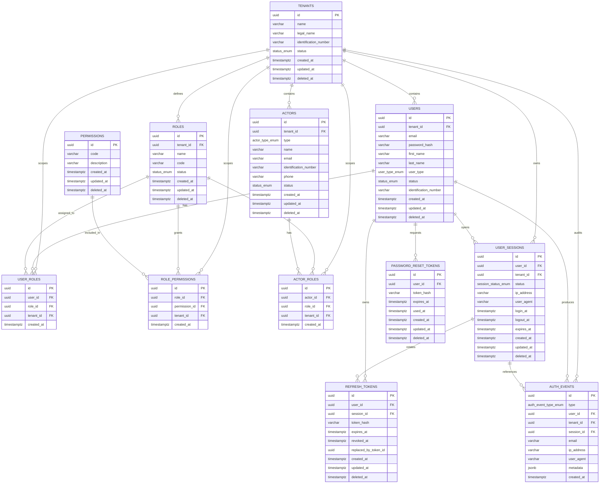

# Obralink Backend

Backend base de identidad y autenticación para un CRM/ERP multitenant. Está construido con NestJS, TypeScript, PostgreSQL, TypeORM, JWT, Passport, `@nestjs/cqrs`, `class-validator` y Bruno para pruebas locales de API.

## Alcance

El proyecto implementa:

- Autenticación con login, refresh token rotativo, logout, logout de todos los dispositivos, recuperación/reset/cambio de contraseña, usuario actual y sesiones activas.
- Identidad multitenant con tenants, usuarios, roles, permisos, actores de negocio y asignaciones usuario-rol / actor-rol / rol-permiso.
- Seguridad por JWT, roles, permisos y contexto de tenant.
- Persistencia por repositorios TypeORM, migraciones y seeds.
- Validación global de requests con `ValidationPipe` y DTOs.
- Trazabilidad con `x-tracking-id`, contexto de request y logs correlacionados.
- Filtro global de excepciones con respuesta JSON estándar.

## Arquitectura Del Proyecto

```text
src/
  app.module.ts
  main.ts
  health.controller.ts
  modules/
    auth/
      domain/              Entidades, enums, contratos de repositorio y servicios
      application/         Commands, queries, DTOs y handlers CQRS
      infrastructure/      TypeORM, JWT, bcrypt y estrategias Passport
      presentation/        Controller, guards y decorators HTTP
    identity/
      domain/              Entidades, enums, repositorios y políticas multitenant
      application/         Commands, queries, DTOs y handlers CQRS
      infrastructure/      TypeORM repositories, entidades ORM, migraciones y guards
      presentation/        Controllers, decorators y presenters HTTP
  shared/
    infrastructure/
      context/             AsyncLocalStorage para contexto de request
      database/            Configuración TypeORM, data source y seeds
      exceptions/          Filtro global y excepción base de aplicación
      logger/              Logger de aplicación con contexto automático
      tracing/             Interceptor global de tracking
```

La arquitectura sigue separación por capas:

- `domain`: reglas de negocio y contratos sin depender de HTTP o TypeORM.
- `application`: casos de uso mediante CQRS (`CommandHandler`, `QueryHandler`) y DTOs.
- `infrastructure`: persistencia, seguridad técnica, integraciones y configuración.
- `presentation`: controllers, guards, decorators y presenters.
- `shared`: infraestructura transversal reutilizable.

## Flujo De Request

1. `main.ts` registra prefijo `/api`, `ValidationPipe` global y Swagger.
2. `RequestTracingInterceptor` valida o genera `x-tracking-id`, lo devuelve en headers y crea el contexto del request.
3. Guards de auth/identity validan JWT, tenant, roles y permisos.
4. Controllers ejecutan commands/queries de CQRS.
5. Handlers aplican reglas de negocio y llaman repositorios.
6. `AppLogger` agrega automáticamente `trackingId`, usuario, tenant y ruta a los logs emitidos durante el request.
7. `AllExceptionsFilter` estandariza errores y conserva el `trackingId`.

## Arquitectura De Base De Datos

La base usa PostgreSQL con UUIDs generados por `pgcrypto`, enums, claves foráneas, índices únicos parciales para registros activos y columnas de borrado lógico (`deleted_at`) en entidades principales.

### Diagrama ER



### Tablas Implementadas

- `tenants`: empresas/tenants del sistema.
- `users`: usuarios globales o de tenant.
- `roles`: roles globales o por tenant.
- `permissions`: catálogo de permisos.
- `user_roles`: asignación de roles a usuarios tenant.
- `role_permissions`: permisos asignados a roles.
- `actors`: actores de negocio del tenant.
- `actor_roles`: asignación de roles a actores.
- `user_sessions`: sesiones autenticadas.
- `refresh_tokens`: refresh tokens hasheados y rotativos.
- `password_reset_tokens`: tokens hasheados de recuperación de contraseña.
- `auth_events`: auditoría de eventos de autenticación.

### Enums

- `status_enum`: `ACTIVE`, `INACTIVE`, `SUSPENDED`.
- `user_type_enum`: `GLOBAL_ADMIN`, `TENANT_ADMIN`, `TENANT_USER`.
- `actor_type_enum`: `CLIENT`, `SALES_REPRESENTATIVE`, `ENGINEER_TECHNICIAN`, `COMMERCIAL_ADMINISTRATOR`, `EXTERNAL_SUBCONTRACTOR`, `ACCOUNTING_FINANCE`, `MANAGEMENT`.
- `session_status_enum`: `ACTIVE`, `REVOKED`, `EXPIRED`.
- `auth_event_type_enum`: `LOGIN`, `FAILED_LOGIN`, `LOGOUT`, `LOGOUT_ALL_DEVICES`, `PASSWORD_RESET_REQUESTED`, `PASSWORD_RESET`, `PASSWORD_CHANGED`, `TOKEN_REFRESH`.

### Índices Y Unicidad

- `uq_users_tenant_email_active`: evita emails duplicados por tenant en usuarios no borrados.
- `uq_users_tenant_identification_active`: evita identificaciones duplicadas por tenant cuando existen.
- `uq_roles_tenant_code_active`: evita códigos de rol duplicados por tenant.
- `uq_permissions_code_active`: evita permisos duplicados activos.
- `uq_actors_tenant_email_active`: evita emails duplicados por tenant en actores.
- `uq_actors_tenant_identification_active`: evita identificaciones duplicadas por tenant en actores.
- `uq_user_roles_user_role_tenant`: evita duplicar un rol para el mismo usuario en el tenant.
- `uq_role_permissions_role_permission_tenant`: evita duplicar un permiso para el mismo rol en el tenant.
- `uq_actor_roles_actor_role_tenant`: evita duplicar un rol para el mismo actor en el tenant.
- `idx_user_sessions_user_status`, `idx_refresh_tokens_user_session`, `idx_password_reset_tokens_user`, `idx_auth_events_user_created`: aceleran consultas operativas de auth.

## Reglas Multitenant

- Los datos operativos se delimitan por `tenantId`.
- El tenant efectivo se obtiene desde el JWT para usuarios tenant.
- `GLOBAL_ADMIN` puede operar a nivel plataforma y puede enviar `tenantId` en endpoints que lo permiten.
- `TENANT_ADMIN` y `TENANT_USER` quedan restringidos a su propio tenant.
- Los usuarios tenant no pueden crear usuarios plataforma.
- El contexto tenant no se toma desde headers.

## Validación

`main.ts` registra un `ValidationPipe` global con:

- `whitelist: true`
- `forbidNonWhitelisted: true`
- `transform: true`

Los bodies, params y queries usan DTOs con `class-validator`. Los IDs de ruta/query (`tenantId`, `userId`, `actorId`, `roleId`) se validan como UUID.

## Trazabilidad Y Logs

Header opcional:

```http
x-tracking-id: 8b7a5a64-7df4-4f6d-a690-a8d0c1e89c7a
```

- Si se envía, debe ser UUID.
- Si no se envía, la API genera un UUID.
- La API devuelve `x-tracking-id` en los response headers.
- El tracking id se propaga durante todo el proceso mediante `AsyncLocalStorage`.
- Los logs emitidos durante el request incluyen `trackingId`, `userId`, `tenantId` y ruta.
- Se registran puntos clave de autenticación, sesiones, tenants, usuarios, actores y roles.

## Excepciones

`AllExceptionsFilter` estandariza las respuestas de error:

```json
{
  "statusCode": 400,
  "code": "BAD_REQUEST",
  "message": "x-tracking-id must be a UUID",
  "trackingId": "8b7a5a64-7df4-4f6d-a690-a8d0c1e89c7a",
  "path": "/api/auth/login",
  "timestamp": "2026-06-02T00:00:00.000Z"
}
```

Para errores propios del dominio o aplicación se puede usar `AppException`, que permite definir `code`, `message`, `status` y `details`.

## Endpoints

La lista resumida de endpoints está en [API_SUMMARY.md](./API_SUMMARY.md).

Swagger/OpenAPI:

```text
http://localhost:3000/api/docs
```

Health check:

```text
http://localhost:3000/api/health
```

## Variables De Entorno

Crear el archivo local:

```bash
cp .env.example .env
```

Variables principales:

```bash
DB_HOST=localhost
DB_PORT=5432
DB_USERNAME=postgres
DB_PASSWORD=postgres
DB_DATABASE=obralink

LOG_LEVELS=error,warn,log,debug
LOG_PREFIX=Obralink
LOG_TIMESTAMP=true
LOG_JSON=false
LOG_COLORS=true

JWT_SECRET=823d507c-d68d-4f97-bcd7-386eef3b9fcc
JWT_ACCESS_TOKEN_TTL_SECONDS=900
JWT_REFRESH_TOKEN_TTL_SECONDS=604800
AUTH_SESSION_TTL_SECONDS=604800
PASSWORD_RESET_TOKEN_TTL_SECONDS=3600

AUTH_RATE_LIMIT_TTL_MS=60000
AUTH_RATE_LIMIT_LIMIT=20
AUTH_LOGIN_RATE_LIMIT_TTL_MS=60000
AUTH_LOGIN_RATE_LIMIT_LIMIT=5
AUTH_PASSWORD_RECOVERY_RATE_LIMIT_TTL_MS=300000
AUTH_PASSWORD_RECOVERY_RATE_LIMIT_LIMIT=3

GLOBAL_ADMIN_EMAIL=admin@obralink.local
GLOBAL_ADMIN_PASSWORD=Admin123!
GLOBAL_ADMIN_FIRST_NAME=Global
GLOBAL_ADMIN_LAST_NAME=Admin
GLOBAL_ADMIN_IDENTIFICATION_NUMBER=0000000000

PORT=3000
```

## Ejecución Local

```bash
npm install
npm run db:up
npm run migration:run
npm run seed:run
npm run start:dev
```

Flujo local completo:

```bash
npm run start:local
```

Comandos útiles:

```bash
npm run setup:local
npm run seed:roles
npm run seed:global-admin
npm run seed:run
npm run migration:show
npm run migration:revert
npm run db:logs
npm run db:down
```

Login con el global admin sembrado:

```http
POST http://localhost:3000/api/auth/login
Content-Type: application/json

{
  "email": "admin@obralink.local",
  "password": "Admin123!"
}
```

## Colección Bruno

La carpeta `obralink/` contiene la colección local. Usa:

- `baseUrl`
- `trackingId`
- `accessToken`
- `refreshToken`
- IDs operativos como `tenantId`, `userId`, `actorId`, `roleId`

El contexto tenant viene del JWT o de parámetros permitidos para `GLOBAL_ADMIN`.

## Verificación

```bash
npm run build
```

El script de lint está definido, pero requiere una configuración `eslint.config.*` compatible con ESLint 9 para poder ejecutarse.
