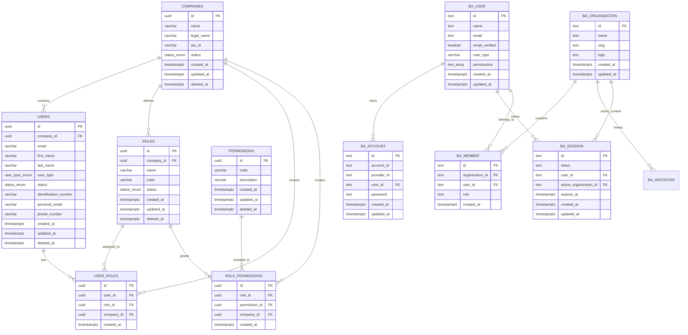

# Obralink Backend

Backend de identidad multitenant para Obralink. Está construido con NestJS, TypeScript, PostgreSQL, TypeORM, Better Auth, `@nestjs/cqrs`, `class-validator` y Swagger.

## Alcance

El backend implementa:

- Autenticación con Better Auth en `/api/auth/*`.
- Sesiones por cookie administradas por Better Auth.
- Multitenancy con el plugin `organization` de Better Auth.
- Empresas, usuarios de dominio, roles y permisos.
- Guards de identidad que convierten la sesión Better Auth en `AuthenticatedIdentity`.
- Persistencia con TypeORM, migraciones y seeds.
- Validación global de requests con `ValidationPipe`.
- Trazabilidad con `x-tracking-id`, contexto de request y logs correlacionados.
- Filtro global de excepciones con respuesta JSON estándar.

## Arquitectura

```text
src/
  app.module.ts
  main.ts
  health.controller.ts
  modules/
    better-auth/
      better-auth.config.ts       Configuracion Better Auth + organization plugin
    identity/
      domain/                     Entidades, enums, repositorios y politicas multitenant
      application/                Commands, queries, DTOs y handlers CQRS
      infrastructure/
        persistence/typeorm/      Entidades ORM y repositorios
        security/                 Guards y provisionamiento Better Auth
      presentation/               Controllers, decorators y presenters HTTP
  shared/
    infrastructure/
      context/                    AsyncLocalStorage para contexto de request
      database/                   TypeORM config, data source, migrations y seeds
      exceptions/                 Filtro global y excepcion base
      logger/                     Logger de aplicacion
      tracing/                    Interceptor global de tracking
```

Capas:

- `domain`: reglas de negocio y contratos sin depender de HTTP o TypeORM.
- `application`: casos de uso mediante CQRS.
- `infrastructure`: persistencia, seguridad técnica e integraciones.
- `presentation`: controllers, guards, decorators y presenters.
- `shared`: infraestructura transversal.

## Autenticacion Y Multitenancy

Better Auth es dueño de:

- Login.
- Logout.
- Sesiones.
- Hash de contraseñas.
- Cookies.
- Organizaciones.
- Membresías.
- Empresa activa.

El módulo `identity` es dueño de:

- Empresas de negocio.
- Usuarios como perfil/dominio.
- Roles internos.
- Permisos internos.
- Políticas de acceso por empresa.

El registro público de Better Auth está deshabilitado. Los usuarios se crean únicamente desde `POST /api/identity/users`, donde el backend registra el perfil de dominio y provisiona internamente `ba_user`, `ba_account` y `ba_member`.

`SYSTEM_OWNER` administra empresas, pero no pertenece a ninguna empresa y no gestiona usuarios internos. Para iniciar una empresa, `SYSTEM_OWNER` crea su administrador inicial desde `POST /api/identity/companies/:companyId/admin`. Luego ese `COMPANY_ADMIN` administra los usuarios de su propia empresa desde `POST /api/identity/users`.

### Diagrama

```text
Frontend / Client
      |
      | Cookie Better Auth
      v
  /api/auth/*
      |
      v
Better Auth
      |
      +--> ba_user
      +--> ba_account
      +--> ba_session
      +--> ba_organization
      +--> ba_member
      +--> ba_invitation
      +--> ba_verification
```

```text
/api/identity/*
      |
      v
AuthenticatedIdentityGuard
      |
      | Lee sesion Better Auth desde cookie
      v
AuthenticatedIdentity
  id        = ba_user.id
  userType  = ba_user.user_type
  companyId  = ba_session.active_organization_id
  permissions = ba_user.permissions
      |
      v
CompanyGuard / RolesGuard / PermissionsGuard
      |
      v
Handlers CQRS + Repositories TypeORM
```

### Claves De Integracion

```text
users.id       = ba_user.id
companies.id     = ba_organization.id
empresa activa = ba_session.active_organization_id
membresia      = ba_member(user_id, organization_id)
```

Cuando se crea una empresa desde `identity`, también se crea su `ba_organization`.

Cuando se crea un usuario desde `identity`, también se crea:

- `ba_user`
- `ba_account` con credencial Better Auth
- `ba_member` si el usuario pertenece a una empresa

## Flujo De Login

```text
POST /api/auth/sign-in/email
      |
      v
Better Auth valida credenciales en ba_user + ba_account
      |
      v
Crea/actualiza sesion en ba_session
      |
      v
Cliente recibe cookie de sesion
```

Para seleccionar la empresa activa, el cliente debe usar los endpoints de organización de Better Auth. El backend toma la empresa desde:

```text
ba_session.active_organization_id
```

El contexto de empresa no se toma desde headers.

## Flujo De Request

1. `main.ts` registra prefijo `/api`, `ValidationPipe`, Swagger y desactiva el body parser de Nest para Better Auth.
2. `RequestTracingInterceptor` valida o genera `x-tracking-id`.
3. Better Auth procesa `/api/auth/*`.
4. En `/api/identity/*`, `AuthenticatedIdentityGuard` valida la sesión Better Auth.
5. `CompanyGuard`, `RolesGuard` y `PermissionsGuard` aplican autorización.
6. Controllers ejecutan commands/queries CQRS.
7. Handlers aplican reglas de negocio y llaman repositorios.
8. `AllExceptionsFilter` estandariza errores y conserva el `trackingId`.

## Base De Datos

PostgreSQL usa UUIDs, claves foráneas, índices únicos parciales y borrado lógico (`deleted_at`) en entidades principales del dominio.

### Diagrama ER



### Tablas

Better Auth:

- `ba_user`
- `ba_account`
- `ba_session`
- `ba_organization`
- `ba_member`
- `ba_invitation`
- `ba_verification`

Dominio Identity:

- `companies`
- `users`
- `roles`
- `permissions`
- `user_roles`
- `role_permissions`

### Enums

- `status_enum`: `ACTIVE`, `INACTIVE`, `SUSPENDED`.
- `user_type_enum`: `SYSTEM_OWNER`, `COMPANY_ADMIN`, `COMPANY_USER`.

### Indices Relevantes

- `uq_users_company_email_active`: evita emails duplicados por empresa.
- `uq_users_company_identification_active`: evita identificaciones de usuario duplicadas por empresa.
- `uq_roles_company_code_active`: evita códigos de rol duplicados por empresa.
- `uq_permissions_code_active`: evita permisos duplicados activos.
- `uq_user_roles_user_role_company`: evita duplicar un rol para el mismo usuario en la empresa.
- `uq_role_permissions_role_permission_company`: evita duplicar un permiso para el mismo rol en la empresa.
- `uq_ba_user_email`: email único en Better Auth.
- `uq_ba_session_token`: token de sesión único.
- `uq_ba_organization_slug`: slug único de organización.
- `uq_ba_member_org_user`: membresía única por usuario y organización.

## Reglas Multitenant

- Los datos operativos se delimitan por `companyId`.
- La empresa efectiva para usuarios de empresa viene de `ba_session.active_organization_id`.
- `SYSTEM_OWNER` puede operar a nivel plataforma y puede enviar `companyId` en endpoints que lo permiten.
- `COMPANY_ADMIN` y `COMPANY_USER` quedan restringidos a la empresa activa.
- Los usuarios de empresa no pueden crear dueños del sistema.
- `COMPANY_ADMIN` tiene acceso administrativo dentro de la empresa.
- `COMPANY_USER` necesita permisos explícitos en `ba_user.permissions`.
- El contexto de empresa no se toma desde headers.

## Endpoints

Todas las rutas usan el prefijo global `/api`.

Swagger/OpenAPI:

```text
http://localhost:3000/api/docs
```

Health check:

```text
http://localhost:3000/api/health
```

### Auth

Los endpoints de autenticación son los de Better Auth bajo:

```text
/api/auth/*
```

Ejemplo de login email/password:

```http
POST http://localhost:3000/api/auth/sign-in/email
Content-Type: application/json

{
  "email": "admin@obralink.local",
  "password": "Admin123!"
}
```

La respuesta establece una cookie de sesión. Los endpoints privados de `identity` esperan esa cookie.

### Identity

- `POST /api/identity/companies`: crea empresa. Requiere `SYSTEM_OWNER`.
- `GET /api/identity/companies`: lista empresas. Requiere `SYSTEM_OWNER`.
- `GET /api/identity/companies/:companyId`: obtiene empresa por id.
- `PATCH /api/identity/companies/:companyId`: actualiza empresa. Requiere `SYSTEM_OWNER`.
- `PATCH /api/identity/companies/:companyId/activate`: activa empresa. Requiere `SYSTEM_OWNER`.
- `PATCH /api/identity/companies/:companyId/suspend`: suspende empresa. Requiere `SYSTEM_OWNER`.
- `POST /api/identity/companies/:companyId/admin`: crea el administrador inicial de empresa. Requiere `SYSTEM_OWNER`.
- `POST /api/identity/users`: crea usuario interno. Requiere `COMPANY_ADMIN`.
- `GET /api/identity/users?companyId=`: lista usuarios por empresa.
- `GET /api/identity/users/:userId`: obtiene usuario por id.
- `PATCH /api/identity/users/:userId`: actualiza usuario.
- `POST /api/identity/users/:userId/roles`: asigna roles a usuario.
- `GET /api/identity/roles?companyId=`: lista roles por empresa.

## Variables De Entorno

Crear archivo local:

```bash
cp .env.example .env
```

Variables principales:

```bash
PORT=3000

DB_HOST=localhost
DB_PORT=5432
DB_USERNAME=postgres
DB_PASSWORD=postgres
DB_DATABASE=obralink
DB_LOGGING=false

BETTER_AUTH_APP_NAME=Obralink
BETTER_AUTH_URL=http://localhost:3000
BETTER_AUTH_BASE_PATH=/api/auth
BETTER_AUTH_SECRET=replace-with-openssl-rand-base64-32
BETTER_AUTH_TRUSTED_ORIGINS=http://localhost:3000,http://localhost:3001

SYSTEM_OWNER_EMAIL=admin@obralink.local
SYSTEM_OWNER_PASSWORD=Admin123!
SYSTEM_OWNER_FIRST_NAME=System
SYSTEM_OWNER_LAST_NAME=Owner
SYSTEM_OWNER_IDENTIFICATION_NUMBER=0000000000
```

`BETTER_AUTH_SECRET` debe ser un secreto real en ambientes no locales. Se puede generar con:

```bash
openssl rand -base64 32
```

## Ejecucion Local

Setup de base de datos, migraciones y seeds:

```bash
npm install
npm run setup
npm run start:dev
```

Flujo completo con setup + watch:

```bash
npm run start:local
```

Comandos utiles:

```bash
npm run db:up
npm run db:down
npm run db:logs
npm run migration:show
npm run migration:run
npm run migration:revert
npm run seed:roles
npm run seed:system-owner
npm run seed:run
npm run build
```

<<<<<<< HEAD
El script de lint está definido, pero requiere una configuración `eslint.config.*` compatible con ESLint 9 para poder ejecutarse.
# obralink-backend
=======
## Trazabilidad Y Logs

Header opcional:

```http
x-tracking-id: 8b7a5a64-7df4-4f6d-a690-a8d0c1e89c7a
```

- Si se envía, debe ser UUID.
- Si no se envía, la API genera un UUID.
- La API devuelve `x-tracking-id` en response headers.
- El tracking id se propaga mediante `AsyncLocalStorage`.

## Excepciones

`AllExceptionsFilter` estandariza respuestas de error:

```json
{
  "statusCode": 400,
  "code": "BAD_REQUEST",
  "message": "x-tracking-id must be a UUID",
  "trackingId": "8b7a5a64-7df4-4f6d-a690-a8d0c1e89c7a",
  "path": "/api/identity/users",
  "timestamp": "2026-06-02T00:00:00.000Z"
}
```

## Verificacion

```bash
npm run build
npm audit --audit-level=high
```

El script de lint existe, pero requiere agregar `eslint.config.*` compatible con ESLint 9 para ejecutarse.
>>>>>>> feature/inicial
