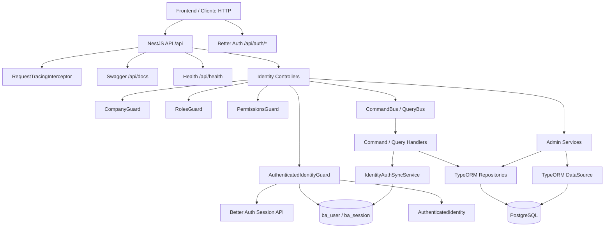
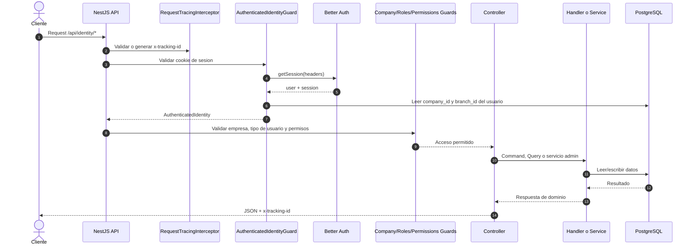
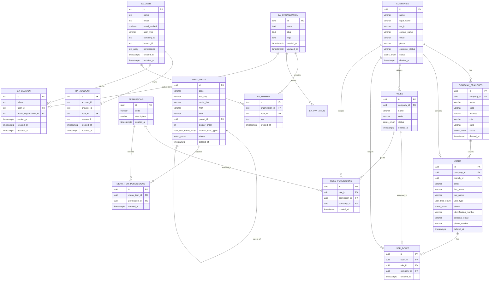

# Obralink Backend

Backend de identidad multitenant para Obralink. Esta construido con NestJS, TypeScript, PostgreSQL, TypeORM, Better Auth, `@nestjs/cqrs`, `class-validator` y Swagger.

## Alcance

El backend implementa:

- Autenticacion con Better Auth en `/api/auth/*`.
- Sesiones por cookie administradas por Better Auth.
- Multitenancy con organizaciones de Better Auth.
- Empresas, sucursales, usuarios de dominio, roles, permisos y menu autorizado.
- Guards de identidad que convierten la sesion Better Auth en `AuthenticatedIdentity`.
- Autorizacion por tipo de usuario, empresa activa, sucursal y permisos.
- Persistencia con TypeORM, migraciones y seeds.
- Validacion global de requests con `ValidationPipe`.
- Trazabilidad con `x-tracking-id`, contexto de request y logs correlacionados.
- Filtro global de excepciones con respuesta JSON estandar.

## Arquitectura

```text
src/
  app.module.ts
  main.ts
  health.controller.ts
  modules/
    better-auth/
      better-auth.config.ts       Configuracion Better Auth
    identity/
      domain/                     Entidades, enums, repositorios y politicas multitenant
      application/                Commands, queries, DTOs, handlers CQRS y servicios de admin
      infrastructure/
        persistence/typeorm/      Entidades ORM y repositorios
        security/                 Guards y sincronizacion Better Auth
      presentation/               Controllers, decorators y presenters HTTP
  shared/
    infrastructure/
      context/                    AsyncLocalStorage para contexto de request
      database/                   TypeORM config, data source, migrations y seeds
      exceptions/                 Filtro global y excepcion base
      logger/                     Logger de aplicacion
      tracing/                    Interceptor global de tracking
```

Capas:

- `domain`: reglas de negocio y contratos sin depender de HTTP o TypeORM.
- `application`: casos de uso mediante CQRS y servicios de administracion.
- `infrastructure`: persistencia, seguridad tecnica e integraciones.
- `presentation`: controllers, guards, decorators y presenters.
- `shared`: infraestructura transversal.

### Diagrama De Componentes



## Autenticacion Y Multitenancy

Better Auth es responsable de:

- Login y logout.
- Sesiones y cookies.
- Hash de contrasenas.
- Organizaciones.
- Membresias.
- Empresa activa de la sesion.

El modulo `identity` es responsable de:

- Empresas de negocio.
- Sucursales de empresa.
- Usuarios como perfil de dominio.
- Roles internos.
- Permisos internos.
- Menu autorizado para el frontend.
- Politicas de acceso por empresa y sucursal.

El registro publico de Better Auth esta deshabilitado. Los usuarios se crean desde endpoints de `identity`, donde el backend registra el perfil de dominio y sincroniza internamente `ba_user`, `ba_account` y `ba_member`.

`SYSTEM_OWNER` administra la plataforma. Puede crear empresas, sucursales, administradores iniciales, roles, permisos y menu. No pertenece necesariamente a una empresa.

`COMPANY_ADMIN` administra usuarios y sucursales de su empresa activa.

`BRANCH_ADMIN` administra usuarios de su empresa con alcance operativo de sucursal.

`COMPANY_USER` opera dentro de su empresa y necesita permisos explicitos para acciones protegidas.

### Claves De Integracion

```text
users.id              = ba_user.id
companies.id          = ba_organization.id
users.company_id      = ba_user.company_id
users.branch_id       = ba_user.branch_id
empresa activa        = ba_session.active_organization_id
membresia             = ba_member(user_id, organization_id)
permisos efectivos    = ba_user.permissions + role_permissions
```

Cuando se crea una empresa desde `identity`, tambien se crea su `ba_organization`.

Cuando se crea un usuario desde `identity`, tambien se crea:

- `ba_user`
- `ba_account` con credencial Better Auth
- `ba_member` si el usuario pertenece a una empresa

## Flujo De Request



## Procesos Implementados

- Login y logout por Better Auth usando cookie de sesion.
- Resolucion de identidad autenticada desde sesion Better Auth hacia `AuthenticatedIdentity`.
- Creacion, listado, consulta, actualizacion, activacion y suspension de empresas.
- Provisionamiento automatico de `ba_organization` al crear empresas.
- Creacion de administrador inicial de empresa por `SYSTEM_OWNER`.
- Creacion, listado, consulta, actualizacion y asignacion de roles a usuarios.
- Provisionamiento automatico de `ba_user`, `ba_account` y `ba_member` al crear usuarios.
- Sincronizacion de permisos efectivos del usuario hacia `ba_user.permissions`.
- Administracion de sucursales de empresa: listar, crear, actualizar y eliminar con borrado logico.
- Aislamiento por sucursal para usuarios que no son `SYSTEM_OWNER` ni `COMPANY_ADMIN`.
- Administracion de roles: listar, crear, actualizar, asignar permisos y eliminar.
- Administracion de permisos: listar, crear, actualizar y eliminar.
- Administracion de menu: listar items para administracion, crear, actualizar y eliminar.
- Consulta de menu autorizado para el usuario autenticado segun tipo de usuario y permisos efectivos.
- Seeds de empresa base, roles/permisos, menu y usuario `SYSTEM_OWNER`.
- Migraciones de esquema para identity, Better Auth, menu, sucursales y `BRANCH_ADMIN`.
- Trazabilidad de requests con `x-tracking-id`.
- Estandarizacion de errores con `AllExceptionsFilter`.

## Base De Datos

PostgreSQL usa UUIDs, claves foraneas, indices unicos parciales y borrado logico (`deleted_at`) en entidades principales del dominio.

### Diagrama ER



### Tablas

Better Auth:

- `ba_user`
- `ba_account`
- `ba_session`
- `ba_organization`
- `ba_member`
- `ba_invitation`
- `ba_verification`

Dominio Identity:

- `companies`
- `company_branches`
- `users`
- `roles`
- `permissions`
- `user_roles`
- `role_permissions`
- `menu_items`
- `menu_item_permissions`

### Enums

- `status_enum`: `ACTIVE`, `INACTIVE`, `SUSPENDED`.
- `user_type_enum`: `SYSTEM_OWNER`, `COMPANY_ADMIN`, `BRANCH_ADMIN`, `COMPANY_USER`.

### Indices Relevantes

- `uq_users_company_email_active`: evita emails duplicados por empresa.
- `uq_users_company_identification_active`: evita identificaciones de usuario duplicadas por empresa.
- `uq_company_branches_company_code_active`: evita codigos de sucursal duplicados por empresa.
- `uq_roles_company_code_active`: evita codigos de rol duplicados por empresa.
- `uq_permissions_code_active`: evita permisos duplicados activos.
- `uq_menu_items_code_active`: evita codigos de menu duplicados activos.
- `uq_menu_item_permissions_menu_permission`: evita duplicar permisos por item de menu.
- `uq_user_roles_user_role_company`: evita duplicar un rol para el mismo usuario en la empresa.
- `uq_role_permissions_role_permission_company`: evita duplicar un permiso para el mismo rol en la empresa.
- `uq_ba_user_email`: email unico en Better Auth.
- `uq_ba_session_token`: token de sesion unico.
- `uq_ba_organization_slug`: slug unico de organizacion.
- `uq_ba_member_org_user`: membresia unica por usuario y organizacion.

## Reglas Multitenant

- Los datos operativos se delimitan por `companyId`.
- La empresa efectiva para usuarios de empresa viene de `ba_session.active_organization_id`; si no existe, se usa `users.company_id`.
- `SYSTEM_OWNER` puede operar a nivel plataforma y puede enviar `companyId` en endpoints que lo permiten.
- `COMPANY_ADMIN` queda restringido a su empresa activa, pero puede operar sobre todas sus sucursales.
- `BRANCH_ADMIN` queda restringido a su empresa y a su `branchId` cuando aplica aislamiento de sucursal.
- `COMPANY_USER` queda restringido a su empresa y necesita permisos explicitos.
- Los usuarios de empresa no pueden crear usuarios `SYSTEM_OWNER`.
- El contexto de empresa no se toma desde headers.

## Endpoints

Todas las rutas usan el prefijo global `/api`.

Swagger/OpenAPI:

```text
http://localhost:3000/api/docs
```

Health check:

```text
http://localhost:3000/api/health
```

### Auth

Los endpoints de autenticacion son los de Better Auth bajo:

```text
/api/auth/*
```

Ejemplo de login email/password:

```http
POST http://localhost:3000/api/auth/sign-in/email
Content-Type: application/json

{
  "email": "admin@obralink.local",
  "password": "Admin123!"
}
```

La respuesta establece una cookie de sesion. Los endpoints privados de `identity` esperan esa cookie.

### Identity

Empresas:

- `POST /api/identity/companies`: crea empresa. Requiere `SYSTEM_OWNER`.
- `GET /api/identity/companies`: lista empresas. Requiere `SYSTEM_OWNER`.
- `GET /api/identity/companies/:companyId`: obtiene empresa por id.
- `PATCH /api/identity/companies/:companyId`: actualiza empresa. Requiere `SYSTEM_OWNER`.
- `PATCH /api/identity/companies/:companyId/activate`: activa empresa. Requiere `SYSTEM_OWNER`.
- `PATCH /api/identity/companies/:companyId/suspend`: suspende empresa. Requiere `SYSTEM_OWNER`.
- `POST /api/identity/companies/:companyId/admin`: crea el administrador inicial de empresa. Requiere `SYSTEM_OWNER`.

Sucursales:

- `GET /api/identity/companies/:companyId/branches`: lista sucursales de empresa.
- `POST /api/identity/companies/:companyId/branches`: crea sucursal. Requiere `SYSTEM_OWNER` o `COMPANY_ADMIN`.
- `PATCH /api/identity/companies/:companyId/branches/:branchId`: actualiza sucursal. Requiere `SYSTEM_OWNER` o `COMPANY_ADMIN`.
- `DELETE /api/identity/companies/:companyId/branches/:branchId`: elimina sucursal con borrado logico. Requiere `SYSTEM_OWNER` o `COMPANY_ADMIN`.

Usuarios:

- `POST /api/identity/users`: crea usuario interno. Requiere `COMPANY_ADMIN` o `BRANCH_ADMIN` y permiso `identity.users.create`.
- `GET /api/identity/users?companyId=`: lista usuarios por empresa. Requiere `SYSTEM_OWNER`, `COMPANY_ADMIN` o `BRANCH_ADMIN` y permiso `identity.users.read`.
- `GET /api/identity/users/:userId`: obtiene usuario por id. Requiere permiso `identity.users.read`.
- `PATCH /api/identity/users/:userId`: actualiza usuario. Requiere `SYSTEM_OWNER`, `COMPANY_ADMIN` o `BRANCH_ADMIN` y permiso `identity.users.update`.
- `POST /api/identity/users/:userId/roles`: asigna roles a usuario. Requiere `COMPANY_ADMIN` o `BRANCH_ADMIN` y permiso `identity.users.roles.assign`.

Roles:

- `GET /api/identity/roles?companyId=`: lista roles por empresa. Requiere permiso `identity.roles.read`.
- `POST /api/identity/roles`: crea rol. Requiere `SYSTEM_OWNER`.
- `PATCH /api/identity/roles/:roleId`: actualiza rol. Requiere `SYSTEM_OWNER`.
- `POST /api/identity/roles/:roleId/permissions`: asigna permisos a rol. Requiere `SYSTEM_OWNER`.
- `DELETE /api/identity/roles/:roleId`: elimina rol con borrado logico. Requiere `SYSTEM_OWNER`.

Permisos:

- `GET /api/identity/permissions`: lista permisos. Requiere `SYSTEM_OWNER`.
- `POST /api/identity/permissions`: crea permiso. Requiere `SYSTEM_OWNER`.
- `PATCH /api/identity/permissions/:permissionId`: actualiza permiso. Requiere `SYSTEM_OWNER`.
- `DELETE /api/identity/permissions/:permissionId`: elimina permiso con borrado logico. Requiere `SYSTEM_OWNER`.

Menu:

- `GET /api/identity/menu`: obtiene el menu autorizado para el usuario autenticado.
- `GET /api/identity/menu/admin`: lista items de menu para administracion. Requiere `SYSTEM_OWNER`.
- `POST /api/identity/menu/admin`: crea item de menu. Requiere `SYSTEM_OWNER`.
- `PATCH /api/identity/menu/admin/:menuItemId`: actualiza item de menu. Requiere `SYSTEM_OWNER`.
- `DELETE /api/identity/menu/admin/:menuItemId`: elimina item de menu con borrado logico. Requiere `SYSTEM_OWNER`.

## Variables De Entorno

Crear archivo local:

```bash
cp .env.example .env
```

Variables principales:

```bash
PORT=3000

DB_HOST=localhost
DB_PORT=5432
DB_USERNAME=postgres
DB_PASSWORD=postgres
DB_DATABASE=obralink
DB_LOGGING=false

BETTER_AUTH_APP_NAME=Obralink
BETTER_AUTH_URL=http://localhost:3000
BETTER_AUTH_BASE_PATH=/api/auth
BETTER_AUTH_SECRET=replace-with-openssl-rand-base64-32
BETTER_AUTH_TRUSTED_ORIGINS=http://localhost:3000,http://localhost:3001

SYSTEM_OWNER_EMAIL=admin@obralink.local
SYSTEM_OWNER_PASSWORD=Admin123!
SYSTEM_OWNER_FIRST_NAME=System
SYSTEM_OWNER_LAST_NAME=Owner
SYSTEM_OWNER_IDENTIFICATION_NUMBER=0000000000
```

`BETTER_AUTH_SECRET` debe ser un secreto real en ambientes no locales. Se puede generar con:

```bash
openssl rand -base64 32
```

## Ejecucion Local

Setup de base de datos, migraciones y seeds:

```bash
npm install
npm run setup
npm run start:dev
```

Flujo completo con setup + watch:

```bash
npm run start:local
```

Comandos utiles:

```bash
npm run db:up
npm run db:down
npm run db:logs
npm run migration:show
npm run migration:run
npm run migration:revert
npm run seed:default-company
npm run seed:roles
npm run seed:menu
npm run seed:system-owner
npm run seed:run
npm run build
```

## Trazabilidad Y Logs

Header opcional:

```http
x-tracking-id: 8b7a5a64-7df4-4f6d-a690-a8d0c1e89c7a
```

- Si se envia, debe ser UUID.
- Si no se envia, la API genera un UUID.
- La API devuelve `x-tracking-id` en response headers.
- El tracking id se propaga mediante `AsyncLocalStorage`.

## Excepciones

`AllExceptionsFilter` estandariza respuestas de error:

```json
{
  "statusCode": 400,
  "code": "BAD_REQUEST",
  "message": "x-tracking-id must be a UUID",
  "trackingId": "8b7a5a64-7df4-4f6d-a690-a8d0c1e89c7a",
  "path": "/api/identity/users",
  "timestamp": "2026-06-02T00:00:00.000Z"
}
```

## Verificacion

```bash
npm run build
npm audit --audit-level=high
```

El script de lint existe, pero requiere agregar `eslint.config.*` compatible con ESLint 9 para ejecutarse.
